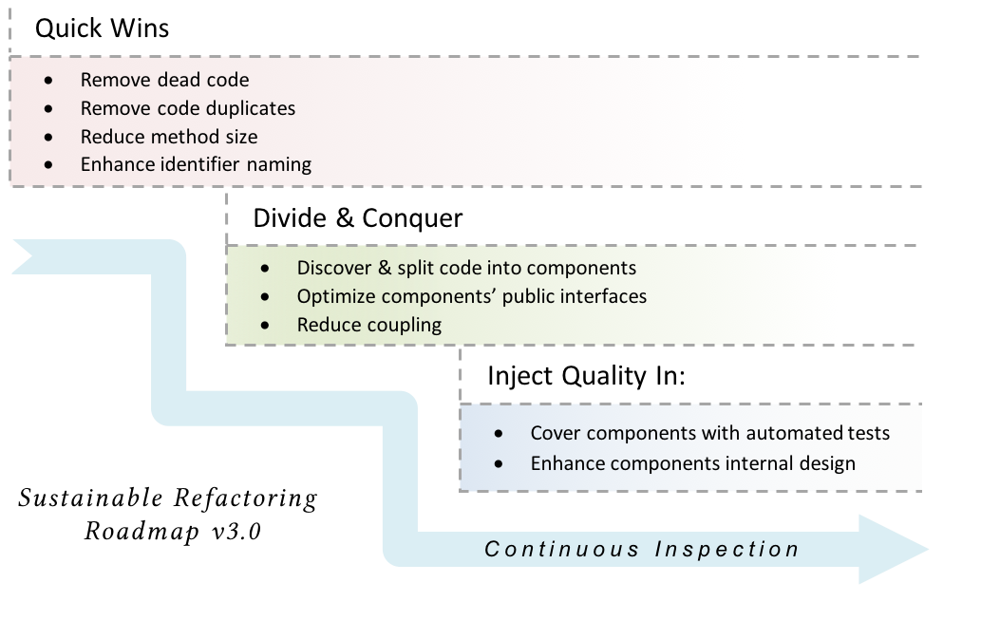

# Refactoring Roadmap Overview

In a nutshell, start with the highest value-add and least risky fixes, then work on re-organizing code chunks into components, and finally wrap everything with automated tests. In all stages, automate checks to make sure what is fixed will remain fixed.

{id="refactoring_roadmap"}

#### Stage 1: Quick-wins - Simple and least risky enhancements

In this early stage of refactoring, we rely heavily on tools to detect and fix issues with code. As appears in the roadmap, the kind of issues we are tackling involve the whole code base. **So, when we _remove dead code_ or _remove code duplicates_, we do this for the whole code base, not part of the code.**

Working on the whole code base magnifies the impact and signifies the improvement. You may put it this way: It may be better to move the whole code one foot forward, rather than to move part of the code a thousand feet forward.

{icon=bookmark}
G> *It may be better to move the whole code one foot forward, rather than to move part of the code a thousand feet forward.*

From my experience, teams working on the quick wins stage for a while usually start feeling "more confident" in enhancing the code and applying refactorings ideas. They also have better grasp and ownership for the code. In my opinion, this is one of the most important and great side effects of this approach to refactoring.

#### Stage 2: Divide & Conquer - Split code into components

After getting rid of most of the fat during the last stage, we gradually start introducing structure into the code. The key idea is to move *similar* code together and let components with clear interfaces emerge gradually.

In most cases, you may find that code is already organized into high level modules. However, such modules may have grown in size and collected so much responsibilities for a middle-size code module. Part of these responsibilities may be perfect candidates to move to another module or form a new one.

#### Stage 3: Inject quality in - Cover components with automated tests

Automated tests is one of the key enablers of quality code. From a development perspective, automated tests empowers the team to refactor entangled code safely. From a customer perspective, automated tests enables fast changes by detecting regression bugs early in the process. At this stage in the roadmap, After working on splitting code into components with clear interface methods, it is a perfect timing to start covering components with automated tests.

#### Continuous Inspection - Ensure what is fixed will remain fixed

Throughout the roadmap, enabling continuous inspection is key to sustainable refactoring. Continuous inspection ensures that the newly-introduced development habits are kept and enforced and ensures that what is fixed will remain fixed. In other words, it ensures that we do not hit the same wall again.
