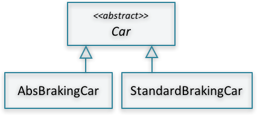
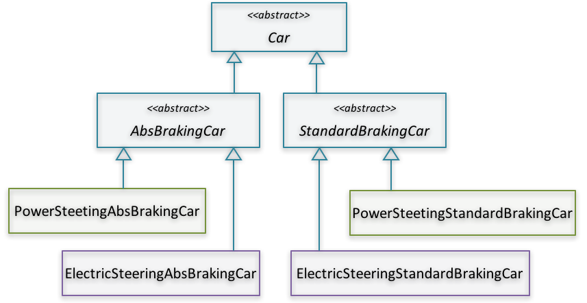

# Stage 1: Quick-Wins

## Removing dead code

{icon=quote-left}
G> *Deleting dead code is not a technical problem; it is a problem of mindset and culture*
G>
G> \- *- Kevlin Henney [^kevlin]*

Dead code is the "unnecessary, inoperative code that can be removed without affecting program’s functionality". These include "functions and sub-programs that are never called, properties that are never read or written, and variables, constants and enumerators that are never referenced, user-defined types that are never used, API declarations that are redundant, and even entire modules and classes that are redundant." [10]

It is fairly intuitive (and was shown empirically) that as code grows in size, it needs more maintenance [4][9]. This can be attributed to three factors:

1. More time needed to analyze code and locate bugs
2. Larger code implies bigger amount of functionality, which, in turn, requires more maintenance
3. Software size has significant influence on quality. This was shown in an empirical study which researched the relationship between several project parameters (including size) and project quality. "Information systems project size was found to be a **significant influence on quality**. That is, as project size increased, project quality decreased." [9, p.6]. This, in turn, has significant effect on maintenance cost

### What's evil about dead code?

There are many reasons why dead code is bad. First of all, it increases the code size, and thus, as described above, increases the maintenance effort [4][9]. For example, Do you recall a case when you kept staring at a piece of code trying to understand why it is commented out? Did you or anyone of your teammates wasted hours of work trying to locate a bug in a piece of code which turned out to be unreachable?

While these are very good arguments, there is another reason which makes removing dead code more compelling. [Fortune magazine tells a story](http://fortune.com/2012/08/02/why-knight-lost-440-million-in-45-minutes/) about Knight Capital Group (KCG), which "nearly blew up the market and lost the firm $440 million in 45 minutes". After investigation, it turned out that the code mistakenly set a flag which enabled the execution of a piece of dead code.

This piece of dead code "had been dead for years, but was awakened by a change to the flag’s value. The zombie apocalypse arrived and the rest is bankruptcy" [5].

### How to detect dead code?

There are plenty of ways to detect dead code. It is as put by Kevlin Henney[^kevlin]: "Deleting dead code is not a technical problem; it is a problem of mindset and culture." [5]

[^kevlin]: [Kevlin Henney](https://en.wikipedia.org/wiki/Kevlin_Henney) is a famous author, keynote speaker, and consultant on software development; and an IEEE Software Advisory Board member

To help you start, here are some ideas how to detect dead code:

#### Static analyzers

Static analyzers detects unused code by semantic analysis of static code at compile or assembly time. For example:

These are also called *Unreachable Code* and it is only one type of dead code. There are many other programming errors which may result into unreachable code, like:

* Exception handling code for exceptions which can never be thrown
* Unused parameters or local variables
* Unused default code in switch statements, or switch conditions which can never be true
* Objects allocated and probably does some internal construction logic, but the object itself is never used
* Unreachable cases in if/else statements

All these cases are simple and straight forward to catch using compilers and static analyzers. More examples of tools in the [Catalogue of practices and techniques](#catalogue). However, if your program allows for dynamic code changes, reflection, or dynamic loading of libraries and late binding; in such cases, static analyzers may not help.

#### Files not touched for so long

One easy and very effective technique is to search for files that has never changed since a while. These are three main reasons why code files did not change for so long [5]:

* it’s just right
* it’s just dead
* it’s just too scary

Of course, this requires that you investigate and check whether the code is dead or not. This may take some time, but unless you investigate you’ll never know.

#### Dynamic program analysis

Runtime monitoring or dynamic program analysis may be used to rule out parts of the code which are **not** dead code. This effectively reduces the amount of code to be inspected.

The idea is the same as measuring test coverage. In test coverage, tools help you pinpoint lines of code which are *not covered by any test*. In dynamic program coverage, tools help you pinpoint lines of code which are *never run by users*, either because the code is dead or because the features themselves are never used.

This is an example of dynamic code coverage report generated by Clover-for-Eclipse:

#### A final note on dead code

Removing dead code is a quick win by all means. It doesn't take time and gives a big relief for the team. In my experience, it took us no more than 2-3 days removing crap and end up with this feeling of achievement! On average, in this small period of time, teams managed to remove 4% to 7% (and in one case 10%) of the total lines of code [2].

{pagebreak}

## Removing code duplicates

{icon=quote-left}
G> *Duplication may be the root of all evil in software*
G>
G> \- *- Robert C. Martin*

It is interesting to read what gurus write about code duplication. You feel like reading about a plague or a catastrophe which you should avoid by all means.

Andrew Hunt, one of the 17 signatories of the Agile Manifesto, and David Thomas, in their book *"The Pragramtic Programmer"*, have put down several principles for Pragmatic Programming, the first of which is: **Don't Repeat Yourself!**

[SonarQube](https://www.sonarqube.org/), the famous tool for continuous inspection of code quality, lists duplication as one of the **seven deadly sins of developers!**[^Sonar]

[^Sonar]: [Developers' Seven Deadly Sins](https://docs.sonarqube.org/display/SONARQUBE45/Developers%27+Seven+Deadly+Sins)

Robert C Martin (aka uncle Bob), the famous author, speaker and developer, says that "Duplication may be the root of all evil in software"[^cleancoding]. In another article[^bobarticle], he is no longer hesitant and asserts that **"Duplicate code *IS* the root of all evil in software design."**

[^cleancoding]: This is mentioned in his famous book: *Clean Code: A Handbook of Agile Software Craftsmanship*

[^bobarticle]: Uncle Bob mentioned this explicitly in his article at infoq: [Robert C. Martin’s Clean Code Tip of the Week #1: An Accidental Doppelgänger in Ruby](http://www.informit.com/articles/article.aspx?p=1313447)

#### What's evil about code duplication

In a study conducted on software expenditure during the 90's, they found that 70 billion of the 100 billion expenditure on development were spent on maintenance; and 60% of which is consumed to *locate defective code* [1]:

Duplication further magnifies time for locating bugs. If you have a defective piece of code duplicated two or three times, then it's not enough to spend the cost of finding the defect once (which already takes 60% of overall defect handling and resolution time). Rather, you'll need to find each and every copy of this defect elsewhere in the code, which is sometimes very expensive or even not possible. what usually happens is that we get an illusion that the bug is fixed upon fixing the first clone, ship the *fixed* software to the customer, who probably become very annoyed and backfire on us that the bug is still there.

#### Why developers copy and paste code?

Well, if code duplication is that evil. Why do we duplicate code all the time? Throughout my career, I noticed developers follow this pattern one way or another: Copy some code, change it to suite your new requirement, and finally test all changes.

This is pretty natural. Actually, I myself always followed this pattern and I'm still following it. And, I've been doing excellent work with teams I worked with. So, where is the problem? The problem is that I always do a forth step which is necessary and cannot be neglected: refactoring. It's ok to copy and paste code only if you're going to refactor this code later on.

Neglecting this step is a fundamental mistake which rightly is one of the "deadly sins of developers", as put by SonarQube.

#### Type of code clones

There are four types of code clones: *Exact, Similar, Gapped, and Semantic*. They are also known as type 1, 2, 3, and 4 of clones. In the following sections, we will shed light on each of them to help you detect and remove them mercilessly!

Note: All examples of code clones are detected by [ConQAT](https://www.cqse.eu/en/products/conqat/overview/), a **Con**tinuous **Q**u**a**li**t**y monitoring tool developed by the Technical University of Munich.

**Type 1: Exact Clones**

These are the most straight forward and the easiest to detect type of clones. Here is an example of an exact clone:

**Type 2: Similar Clones**

Similar clones are more common than exact clones because most probably, when a programmer copies some code, he/she changes or renames some of the variables or parameters:

As you can see in the above example, clones are exactly the same except for some renamed identifiers. Note that the structure of the code is the same, and the positions of the renamed identifiers are all the same.

**Type 3: Gapped Clones (aka inconsistent clones)**

This type of clones are very interesting. These are exact or similar code clones with one or two lines of code changed (either added, deleted, or modified). These changes are called *Gaps*. Why are they interesting? Because probably they are defects fixed in one location and wasn't fixed in the others!

In both above examples, you need to review the code before fixing anything. It may be a valid business case or a *dormant bug*. Unless you review, you will never know.

**Type 4: Semantic clones**

The forth type of clones deals with fragments of code doing the same thing but not sharing similar structure. For example, implementing a routine which calculates the factorial of a number, one using loops and another using recursion:

{lang="java"}
~~~~~~~~
int factorialUsingLoops(int n){
  int factorial = 1;
  for(int i = 1; i <= n; i++)
    factorial = factorial * i;

  return factorial;
}
~~~~~~~~

{lang="java"}
~~~~~~~~
int factorialUsingRecursion(int n){
  if (n == 0)
    return 1;
  else
    return(n * factorialUsingRecursion(n-1));
}
~~~~~~~~

There are lots of efforts in the academia to research whether it is possible to detect type 4 of code clones or not. Till they reach something tangible, let's focus our attention to detect and remove the first three types of code clones.

A> #### Dormant Bugs and Gapped Clones
A> *Dormant bugs* are bugs which have lived some time on production before they are discovered. Recent studies found that 30% of bugs are dormant. This is scary, because this indicates that there are dormant bugs with each and every deployment. You have no idea when they will fire back; you have no idea what would be the side effects [6].
A>
A> Now, think about gapped clones. These are typically probable dormant bugs on production. Another study shows that the percentage of gapped clones in software systems running in large enterprises are 52%. Among these clones, 18% are system faults or defects [7]:
A>
A> 
A>
A> This means that if you managed to remove 100 gapped clones, then congratulations! You've removed **18 dormant bugs!**

#### Removing code duplicates ####

There are several refactoring techniques for removing duplicate code. The safest and most straight forward technique is to 'Extract Method', and point all duplicates to it. This is relatively a safe refactoring specially if you rely on tool support to automatically extract methods.

In all projects that I've worked on, we were very cautious while removing duplicates. These are several pre-cautions to keep in mind:

* Rely on automatic refactoring capabilities in IDE's to extract methods. Sometimes, it is the most obvious mistakes which you may spend hours trying to discover. Relying on automatic refactoring support will reduce or even eliminate such mistakes.
* Any change, what so ever, must be reviewed.

Keeping these two pre-cautions in mind will save you, especially that we are refactoring on the mainline, not on a separate long living branch. More on this in this previous chapter on [how to prepare a healthy environment](#beforeYouStart) section.

{pagebreak}

## Reduce method size

{icon=quote-left}
G> *Refactoring: A change made to the internal structure of software to make it easier to understand and cheaper to modify without changing its existing behavior.*
G>
G> \- *- Martin Fowler [8]*

One thing I like about this definition is the clearly-stated objectives of refactoring, which are to make software:

1. Easier to understand
2. Cheaper to modify

Having these two objectives in mind, it's possible to develop your "gut feeling" about the correct length of a method. So, let's agree for now that **a method is *good* and needs no further refactoring when it fulfills these two criteria of being understandable and modifiable**.

#### An experiment on method size

I have done this experiment with university students. I gave them three variants of a method: without comments, with comments, and refactored into a small 5-line method. I have measured the time it takes them to understand the intent of the method. Results were as follows:

* Method without comments: **~ 2 minutes**
* Method with comments: **~ 1 minute**
* Refactored short method: **~ 10 seconds**

I advice you to do this experiment with your team. Get a stopwatch and use the sample code below or any piece of code from your project. **It is stunning how much time you save by just reducing methods sizes into smaller ones with readable private method calls**. It realizes the core objective of refactoring: to make the code "easier to understand and cheaper to modify".

Ready? Go!

A> **Method with no comments**
A>
A>{lang="java"}
A>~~~~~~~~
A>public List criteriaFind(String criteria) {
  if (criteria == null)
    criteria = "";
A>
  List criteriaList = scanCriteria(criteria);
  List result = new ArrayList();
  Iterator dataIterator = getDataCash().iterator();
  Iterator criteriaIterator = null;
  DataInfo currentRecord = null;
  List currentCriterion = null;
  boolean matching = true;
A>
  while (dataIterator.hasNext() && !interrupted) {
    currentRecord = (DataInfo) dataIterator.next();
A>
    criteriaIterator = criteriaList.iterator();
    while (criteriaIterator.hasNext() && !interrupted) {
      currentCriterion = (List) criteriaIterator.next();
      if (!currentRecord.contains((String) currentCriterion.get(0),
        (String) currentCriterion.get(1))) {
        matching = false;
        break;
      }
    }
    if (matching)
      result.add(currentRecord);
    else
      matching = true;
  }
  if (interrupted) {
    interrupted = false;
    result.clear();
  }
  Collections.sort(result);
  return result;
}
~~~~~~~~

This is a 36-line method. It seems to be small. However, you've spent some time (probably around 1-2 minutes) to grasp how the code works. So, **according to our definition, is this method *maintainable*? The answer is no**.

Now, consider this enhanced version of the method:

A> **Method with explanatory comments**
A>
A> {lang="java"}
A> ~~~~~~~~
A> public List criteriaFind(String criteria) {
A>  if (criteria == null)
A>    criteria = "";
A>
A>  // convert the criteria to ordered pairs of field/value arrays.
A>  List criteriaList = scanCriteria(criteria);
A>  List result = new ArrayList();
A>
A>  // search for records which satisfies all the criteria.
A>  Iterator dataIterator = getDataCash().iterator();
A>  Iterator criteriaIterator = null;
A>  DataInfo currentRecord = null;
A>  List currentCriterion = null;
A>  boolean matching = true;
A>
A>  while (dataIterator.hasNext() && !interrupted) {
A>    currentRecord = (DataInfo) dataIterator.next();
A>
A>    // loop on the criteria; if any criterion is not fulfilled
A>    // set matching to false and break the loop immediately.
A>    criteriaIterator = criteriaList.iterator();
A>    while (criteriaIterator.hasNext() && !interrupted) {
A>      currentCriterion = (List) criteriaIterator.next();
A>      if (!currentRecord.contains((String) currentCriterion.get(0),
A>        (String) currentCriterion.get(1))) {
A>        matching = false;
A>        break;
A>      }
A>    }
A>    if (matching)
A>      result.add(currentRecord);
A>    else
A>      matching = true;
A>  }
A>
A>  // clear results if user interrupted search
A>  if (interrupted) {
A>    interrupted = false;
A>    result.clear();
A>  }
A>
A>  // Sort Results
A>  Collections.sort(result);
A>  return result;
A>}
A>~~~~~~~~

Adding some comments are generally perceived to enhance code understandability. It may clutter the code a bit, but at least in this example, the code is a little more readable. But, wait a minute, if we are adding comments to make the code more readable, isn't this an indication that the code is not maintainable? According to our definition of maintainability, the answer is yes. This is why *explanatory comments* are generally considered a code smell, or a sign of bad code.

I> *If we are adding comments to make the code more readable, isn't this an indication that the code is not maintainable? According to our definition of maintainability, the answer is yes. This is why __explanatory comments__ are generally considered a code smell, or a sign of bad code.*

Now, let's work on this method. If you notice, comments are placed at perfect places. They give you a hint of the *Boundaries of Logical Units* inside the method. Such logical units are functionally cohesive and are candidate to become standalone methods. Not only that, the comment itself is a perfect starting point for naming of the newly born method.

So, by extracting each chunk into a standalone method, we will reach this version of the method:

A> **_After extracting method steps into private methods_**
A>
A>{lang="java"}
A>~~~~~~~~
public List criteriaFind(String criteria) {
  List criteriaList = convertCriteriaToOrderedPairsOfFieldValueArrays(criteria);
  List result = searchForRecordsWhichSatisfiesAllCriteria(criteriaList);
  clearResultsIfUserInterruptsSearch(result);
  sortResults(result);
  return result;
}
A>~~~~~~~~

This is a 5-line method which narrates a story. No need to write comments or explain anything. It is self-explanatory and much easier now to instantly capture the intent of the code.

A> #### Logical units of code
A>
A> Notice that the original form of the `criteriaFind` method in the above example is functionally cohesive and follows the Single Responsibility Principle (SRP) in a perfect way. However, if you look inside the method, you may notice what I call *Logical Units of Code*, which are *steps of execution*; each one is several lines of code. A single step does not implement the full job, but it implements a conceivable part towards the goal.
A>
A> Examples of logical units may be an if statement validating a business condition, a for loop doing a batch job on a group of data records, a query statement which retrieves some data from the database, several statements populating data fields on a new form, etc. In my experience, sometimes the logical unit are as small as two or three lines of code. More frequently, they are bigger (like 5 to 12 lines). On very rare occasions I see logical units which are bigger than that.
A>
A> This is an example of logical units of code, extracted from the famous [OpenBravo](https://github.com/bippo/openbravo) open source ERP solution. Notice how comments help you identify these units:
A>
A> 
A>
A> Such logical units are perfect candidates to be extracted into *private* methods. If you adopt this practice for a while, you'll start noticing some private methods which are similar in nature or shares the same "interest". In such case, you may extract and group them into a new logical component. More about this in the [Divide and Conquer](#DivideAndConquer) stage.

## Enhance identifier naming

{icon=quote-left}
G> *You know you are working on clean code when each routine you read turns out to be pretty much what you expected [^clean-ron]*
G>
G> \- *- Ron Jeffries*

In an interesting study titled: *Concise and Consistent Naming*, the authors has conducted token analysis on Eclipse 3.0 code, and found that *"Approximately 70% of the source code of a software system consists of identifiers"* [17]:

This is why "the names chosen as identifiers are of paramount importance for the readability of computer programs and therewith their comprehensibility". Imagine that every class, method, parameter, local variable, every name in your software is indicative and properly named, imagine how readable your software will become.

The good news is that renaming has become a safe refactoring which we can apply with minimal side effects; thanks to the automatic rename capability available in most modern IDE's.

A> #### Explanatory methods and fields
A>
One of the interesting tools to enhance code readability is to use *explanatory methods and fields*. The idea is very simple: if you have a one line code which is vague and not self-explanatory, consider extracting it into a standalone method and give it an explanatory name.
A>
Similarly, if you have a piece of calculation whose intent is not clear, consider extracting it into a field and give an explanatory name.
A>
{lang="java", linenos=off}
~~~~~~~~
public Boolean bookSeats(Request request) {
  Boolean bookingResult = new Boolean(dataHandler.book(dataHandler
      .getRecord(((Integer)request.getParametersList().get(0)).intValue()),
        ((Integer)request.getParametersList().get(1)).intValue()));
  return bookingResult;
}
~~~~~~~~
A>
**`dataHandler.book` parameters are not clear**. There is a difficulty understanding what kind of parameters we are passing. In stead, we can use **explanatory methods** as such:
A> *Using explanatory methods:*
A>
{lang="java", linenos=off}
~~~~~~~~
public Boolean bookSeats(Request request) {
  Boolean bookingResult = new Boolean(dataHandler.book(getFlightRecord(request),
    getNumberOfSeats(request)));
  return bookingResult;
}
private DataInfo getFlightRecord(Request request){
	return dataHandler
    .getRecord(((Integer)request.getParametersList().get(0)).intValue());
}
private int getNumberOfSeats(Request request) {
	return ((Integer)request.getParametersList().get(1)).intValue();
}
~~~~~~~~
A>
Or, we can use **explanatory fields** as such:
A> *Using explanatory fields:*
A>
{lang="java", linenos=off}
~~~~~~~~
public Boolean bookSeats(Request request) {
  DataInfo flightRecord = dataHandler.getRecord(
    ((Integer)request.getParametersList().get(0)).intValue());
  int numberOfSeats = ((Integer)request.getParametersList().get(1)).intValue();
  Boolean bookingResult =
    new Boolean(dataHandler.book(flightRecord, numberOfSeats));
  return bookingResult;
}
~~~~~~~~
A>
My advice is to always use explanatory methods and fields. They are extremely simple and astonishingly helpful tool to enhance program readability.

[^clean-ron]: Quoted in *Leading Lean Software Development: Results Are not the Point*, by Mary and Tom Poppendieck.

## Considerations related to the quick-wins stage

#### Avoid introducing inheritance trees

One tempting technique to remove duplication is to introduce a parent type which gathers common behavior among two or more child types:

In general, I prefer composition over inheritance. Inheritance hierarchies are notorious for their complexity and difficulty of understanding polymorphic behavior of sub-types. Moreover, they are especially not recommended at this very early stage of refactoring.

Instead, you may chose one of the following three simple alternatives:

1. *Inline Classes* into one class, especially if the coupling and/or level of duplication is high between the two of them.
1. *Extract Methods* in class B and reuse them in class A. This creates a dependency on B, which may or may not be a bad thing.

    

1. If coupling between A and B is bad, then *Extract Methods* in A and then *Move Methods* to an existing common class. If no candidate common class is available, use the *Extract Class* refactoring to extract the common methods to a new class C. In both cases, A and B will depend on the common class C:

    

A> #### Why we should favor composition over inheritance
A>
A> This is a controversial topic since the inception of object-oriented design. A lot has been said about when to use inheritance and whether you should favor composition and when. However, it seems there is a general "impression" that overuse of inheritance causes problems and deteriorates program clarity; something which we are already trying to avoid. Here are some references:
A>
A> * The GOF book, way back in 1995, advices us to "Favor 'object composition' over 'class inheritance'." They rightly argue that "because inheritance exposes a subclass to details of its parent's implementation, it's often said that 'inheritance breaks encapsulation'" [12]
A> * Eric S. Raymond, in his book *The Art of Unix Programming*, argues that the overuse of inheritance introduces layers in code and "destroys transparencies" [13]. I absolutely agree on this. From my experience, looking for a bug in a pile of inheritance hierarchy with five or six layers of polymorphic behavior is like searching for a needle in a haystack!
A>
A> Im many cases, using composition with the [Strategy pattern](https://en.wikipedia.org/wiki/Strategy_pattern) hits a sweet spot between composition and inheritance. Consider this example: We are building a car system simulator in which a car may have two breaking systems: standard and ABS. In this case, it may be straight forward to use inheritance:
A>
A> 
A>
A> Now, consider adding a capability to simulate two steering systems: Power and Electric. If we continue using inheritance, we will have to introduce duplication, the enemy of clean code. In the example, the logic of power steering is now duplicated in both `PowerSteeringAbsBrakingCar` and `PowerSteeringStandardBrakingCar`, and the logic of electric steering is duplicated in both `ElectricSteeringAbsBrakingCar` and `ElectricSteeringStandardBrakingCar`
A>
A>
A> 
A>
A> Instead, let's collapse this inheritance tree, and use composition with the Strategy pattern. Here, we will design a Car with many components, each component is an *abstract strategy* which may have several *concrete implementations*:
A>
A> 

#### Always rely on tools support

One important consideration in this stage is that **no manual refactoring is allowed!**. Detecting dead code, detecting and removing code clones, extracting methods to reduce method size, renaming identifier names; you can carry out all such tasks with the assistance of strong IDE features or add-on tools.

Using automated refactoring tools contributes to safety and makes developers more confident when dealing with poor and cluttered code.

#### Should we do them in order?

Yes, with little bit of overlap. This is logical and practical. For example, removing dead code, removes about 10% of your code duplicates[^deadcode].

[^deadcode]: This was validated in one of our experiments. We found that removing dead code removes also 10% of duplicate code [2]. This is totally reasonable, because a good portion of duplicated code are eventually abandoned.

Another example is working on reducing method size before removing duplicates. This actually is a bad practice. Because you may split a method apart while it is actually a duplicate of another. In this case, you have lost this similarity and may not be able to detect this duplication anymore.

#### Are these refactorings safe?

Sometime, applying any change to production code is scary. Changes may result in unexpected flows and incorrect side effects, especially if the code is entangled. If this is the case, is it safe to carrying out those changes the quick-wins stage?

In one of my experiments, the team applied the quick-wins refactorings side by side while developing new features. I have compared the results of this release with the previous release which witnessed new features development only. Table 4 compares some quality metrics of both releases. Note that effort spent on both releases are exactly 4 months, team members are the same, and they did not introduce any improvements in their process except their work on refactoring:

TABLE 4. QUALITY METRICS FOR TWO RELEASES: 5.5 (BEFORE WORKING ON REFACTORING), AND 5.6 (RELEASED WHILE WORKING ON REFACTORING)

{title="Quality metrics for two releases: 5.5 (released before working on refactoring), and 5.6 (released while working on refactoring)"}

|Metric                          | Release 5.5 | Release 5.6 |
| Total bugs detected             | 128         | 176         |
| % of Regression bugs            | 29.7%       | 25.1%       |
| Average bug fixing cost (hours) | 1.97        | 1.8         |

Two important observations from this table:

* Percentage of regression bugs and average cost of bug fixing decreased. Although this may give an indication of better code quality, the difference in numbers is not significant
* Refactorings applied during release 5.6 did not produce higher rates of regression bugs. This is a proof that refactorings did not impact existing functionality or introduce further defects.
