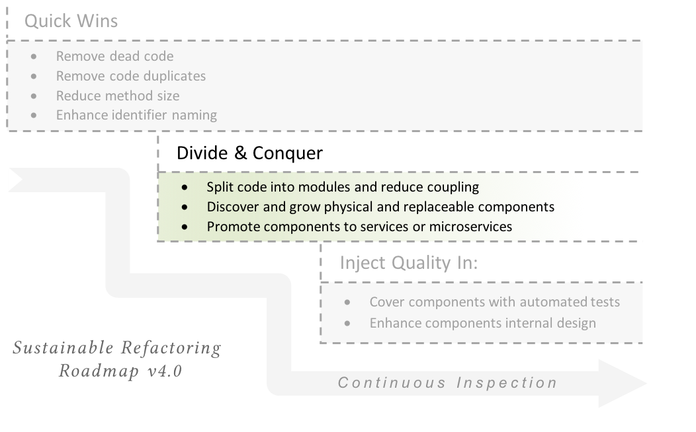
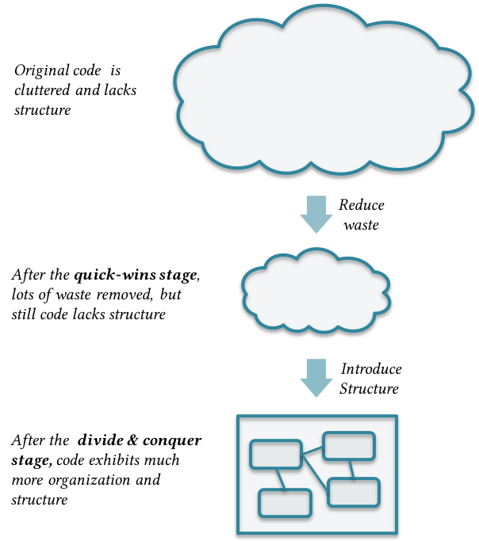
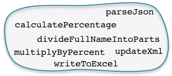
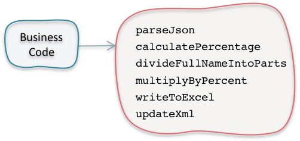
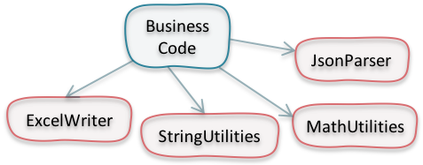
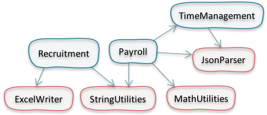
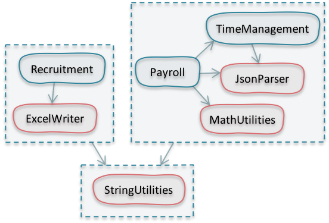
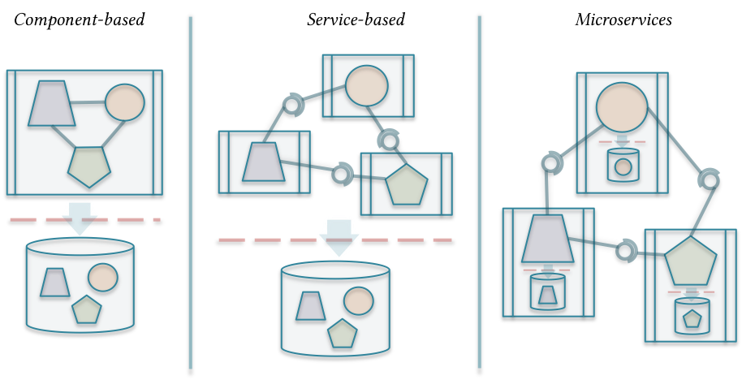
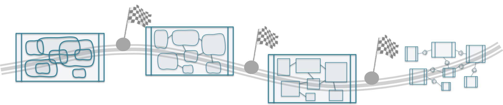

# Stage 2: Divide and Conquer {#DivideAndConquer}

**Software design is all about components and their relationships**. The better you divide your software into loosely-coupled and highly-cohesive parts, the more comprehensible, more responsive to change, and more agile your software design becomes. The act of partitioning your software in this manner is described by Fairbanks as authoring "a story at many levels", which results in a software design that will "tell a story to whoever looks at it, and it will be easy to understand":

> *"To be comprehensible, your software should be structured so that it reveals a story at many levels. Each level of nesting tells a story about how those parts interact. A developer who was unfamiliar with the system could be dropped in at any level and still make sense of it, rather than being swamped."*
>
> \- George Fairbanks [14]

Now, here is a question: If software partitioning is that important, why didn't we start with it right away in the [refactoring roadmap](#refactoring_roadmap)?

We can describe what we achieved so far as **removing "fat" from the application's body of code;** namely, removing dead code, and reducing code duplication, plus applying some very basic and intuitive enhancements which makes the code slightly more readable, like reducing method size and using proper naming conventions. This is like *preparing the scene* or *organizing our backyard* before we start on re-organizing the parts. And, this has two very important side effects:

1. We have saved the time that we would have spent working on dead or duplicate code
2. The team reached a better grasp of the code while scanning and reviewing duplicates and suspect dead code. They formed better understanding while breaking up large methods and trying to give better names to identifiers and code constructs

I have noticed the effect in the second point above many times while working with teams on refactoring. As I explained before in the Introduction and Background section, teams become more courageous and bold in enhancing the code especially after the quick-wins stage.

Although all the enhancements in the quick-wins stage made the code *better*, but it still *lacks structure*. The mission now is introducing structure by discovering/uncovering components and enhance their interfaces:

## Modules, components, services, or micro-services?

First, we need to answer this question: Are we splitting our code into modules, components, or services? Before we do that, let's agree on what a module, component, and service is.

#### Module

The *UML Reference Manual* provided a very brief and broad definition of what a module is. It is a *"software unit of storage and manipulation"* [19, pp 334].

To elaborate on this definition, **a module is any logical grouping of cohesive code functions which provides access to these functions in a uniform manner**. This can be as big as a sub-system, like an accounting or HR module, or as small as a class, like a calculator or an xml parser.

#### Component

{icon=quote-left}
G> **A component is a physical and replaceable part of a system that conforms to and provides the realization of a set of interfaces. It is intended to be easily substitutable for other components that meet the same specifications.**
G>
G> \- *- The UML Reference Manual [19, pp. 10]*

From this definition, we understand that a component is a physical standalone file; a jar, war, dll, gem, etc. Also, it is replaceable, meaning that it can be deployed/redeployed on its own. Finally, we understand that a component may contain one or more smaller modules; and vice versa, a big module may contain one or more components.

#### Service

In essence, web services (or just services), are components. They are physical, replaceable, provides clear interfaces, and easily substitutable. However, there is value in differentiating services from components.

{icon=quote-left}
G> **A service is similar to a component in that it's used by foreign applications. The main difference is that I expect a component to be used locally (think jar file, assembly, dll, or a source import). A service will be used remotely through some remote interface, either synchronous or asynchronous (eg web service, messaging system, RPC, or socket.)[^fowler_article]**
G>
G> \- *- Martin Fowler*

[^fowler_article]: This quote is from Martin's article: [Inversion of Control Containers and the Dependency Injection pattern](https://www.martinfowler.com/articles/injection.html). You will find other interesting distinctions between components and services in Martin's famous article: [Microservices: a definition of this new architectural term](https://martinfowler.com/articles/microservices.html)

One very important difference between a component and a service is that a component cannot run on its own. It has to be integrated in a bigger whole to achieve any value out of it. Unlike a service, which is available and standalone. It can be located and used whether on its own or as part of a bigger application.

#### Then what?

So, what's the value of outlining these differences between modules, components, and services?

As you may noticed from the past definitions, there are higher level of decoupling and increased formality in defining interfaces when moving from modules to components to services.

Modules may co-exist in the same (physical) deployable package; unlike components or services, which are physically standalone.

Modules and components run typically in the same process; unlike services, which runs every service in its own process. Modules and components may communicate through in-memory method calls, while services may require inter-process communication through web-service requests, remote procedure calls, etc.

So, services enjoy the maximum level of decoupling. You can view them as standalone applications which could be glued together in order to provide greater value for some end user.

Now, the questions is: **Do we need to divide our code into modules or components or services?** The answer that I can provide is: Divide the code into modules. Then, assess whether or not it is useful and safe to upgrade them to components or services.

{icon=bookmark}
G> **Divide the code into modules. Then, assess whether or not it is *useful and safe* to upgrade them to components or services.**

A> ## About Microservices
A>
A> In the above discussion, I have talked about web-services (or just services). The main difference between services and microservices is that services share a common datastore, whereas each microservice has a separate standalone datastore.
A>
A> When looking from the angle of refactoring legacy or monolithic application code bases, it is not feasible to exert any effort or even think about splitting a large backend database into smaller ones and move towards a microservices architecture. Some other challenges looms in the way like handling distributed transactions and understanding and supporting the call chain for every business transaction[^nealford].
A>
A> I'll discuss some considerations related to microservices later in this chapter. For now, let's accept that a middle-way is a course-grained service, following a service-based architecture of some kind.

[^nealford]: More discussion about why microservices architecture is not suitable when refactoring monolithic applications is at this excellent talk by Neal Ford: [Comparing service-based architectures](https://vimeo.com/163918385).

## Moving from spaghetti to structured code

The journey from spaghetti and tangled to structured code and from Big Ball of Mud[^ballofmud] to modular design is progressive and multi-stage. Code with large amount of technical debt usually looks like this figure. No clear boundaries between modules, high level glimpses of module interfaces, unstructured or unbounded module communication, etc.

[^ballofmud]: A [https://en.wikipedia.org/wiki/Big_ball_of_mud](Big Ball of Mud) is a conventional name for the architecture of a system which lacks "conceivable structure". Usually, the code as well lacks structure and all parts are tangled and highly coupled.

Gradually, we start moving methods and classes around to let modules emerge and become more apparent. This process is usually referred to as *sprout classes* described by Micheal Feathers [18]. This process can be generalized to *sprout modules* or *sprout components*. The idea is that modules and components emerge while refactoring code.

To do that, we use safe refactorings with support of an automated refactoring tools. In most of the cases, you can depend on the following refactorings:

* Rename
* Extract Method/Class/Interface
* Move Method/Class

This results in clearer module boundaries and better manifestation of module interfaces.

Next, we should concentrate on more decoupling modules and create a solo-deployable components. At this stage, we should work more on polishing interfaces, move away un-needed interface methods and interface parameters. Some useful refactorings at this stage are:

* Change Method Signature (to remove or reorder method parameters)
* Introduce Parameter
* Introduce Parameter Object
* Turn Public Methods Private

You may stop at this stage. Or, you may move to the next step and turn components into services. Remind you that you may chose to do so only if you find it *valuable and safe*.

In the next section, let's take an example of how code structure emerge, and how sprout modules and components are born.

#### Sprout Classes, Modules, and Components

Consider a business application with all its business coded in one big module. The code base is becoming very large and maintenance is definitely taking so much time. This image depicts some of the distinctive methods in this module:

The first step might be to group such utility methods and move them to a standalone "sprout" utility class. Take into account that till now we are not concerned with the best design of this module or the overall system. We are just grouping similar code together:

After a while, you may notice that the utility class has grown in size and is candidate for being split into separate more specialized utility classes:

In the meanwhile, you might be tempted to split the business module itself into more cohesive and standalone parts. This will definitely enhance the readability of the code and alleviate some of the maintenance pain:

Now, you have much better grasp of the system, you may draw the boundaries of your components more smoothly. Splitting the system into physical and replaceable components will divide the overall complexity of the system into smaller and manageable parts. It will make any future change more contained in one or two components. It will also make your live much easier while deploying the system to production. You don't need to replace the while system because now you have the luxury of deploying the updated part only:

Notice how we let the design of the system emerge. With very small steps of extracting methods and classes and moving things around we were able to *sprout* new modules and components and *see* the new structure of the system.

#### From component-based architecture to microservices

Now, let's consider this valid question: Shall we move forward to services or microservices or stop at this stage? The bottom line is to reach a component-based architecture, where all components are disjoint and can be deployed each one on its own. Sometimes, it's wise to stop and reap the benefits. In other cases (for instance, when scalability is a concern), it may be a good choice upgrading the system to several (3-4) big web-services. In this case, you'll get some of the benefits of service-based architectures without paying the cost of moving to microservices.

The next question is: Shall we move forward to microservices? Actually, this depends on your objectives out of refactoring. These might be some of your possible objectives:

* Better quality and more structured code.
* Better maintainability. Changes need not take ages to be developed.
* Disjoined parts, so that updating one won’t blow-up others!
* Faster time to develop and deploy new features.

If your objectives are around these ideas, then you don't need to move to microservices, because most probably you have already achieved these objectives by refactoring to component-based or service-based architectures.

In the meanwhile, there are some benefits that may not be achieved unless you move to microservices; namely, scalability and resilience. However, as put by Martin Fowler, its the **Microservice Trade-Offs**[^fowlertradeoffs]. Meaning that nothing is for free and you need to pay some costs and mitigate some risks when moving to microservices:

1. Risks of splitting the monolithic data store into multiple smaller ones, most probably organized around the idea of [*Bounded Contexts*](https://martinfowler.com/bliki/BoundedContext.html). With databases collecting huge amount of data over the years, splitting this database definitely incurs huge risks.
2. Synchronization and aggregation of data among several data-stores
3. Costs for hosting the new architecture.
4. Required skills and calibers.
5. Tools needed to operate and maintain the new development and production environments.
6. Security risks and issues. The increased number of services also increases the number of vulnerable points hackers may attack and compromise.

[^fowlertradeoffs]: [Microservice Trad-Offs](https://martinfowler.com/articles/microservice-trade-offs.html#summary) is an article by Martin Fowler which highlights what trade-offs you may consider when moving to microservices.

{icon=bookmark}
G> **Think twice before moving to microservices. You might be over-engineering your solution and adding unnecessary complexity. In many cases, it may not be the right decision, considering the costs and overheads.**

#### Stations not stages

This is a my viewpoint summarizing the dilemma of refactoring to microservices, to deal with it as a **journey with many stations**.

 Consider moving your code to modules then components and probably services as stations in the journey from monolithic application architecture to microservices. Each step is an achievement and results in a better overall code structure. Taking one step forward is rewarding and manageable as opposed to moving all the way till the end. After each step, you may pause, inspect and adapt, then decide whether to move forward or break off if you're satisfied with what you've achieved:

## Types of software components - Strategies for code decomposition

This section is a primer about types of software components, which follows some universal types that many experienced developers have noted. Being aware of these types will help you detect/uncover modules and enhance your code structure more effectively and efficiently.

The following two guidelines are *the general strategy for code decomposition*:

* **Guideline 1: Let modules emerge by grouping similar code together.**
* **Guideline 2: If a module becomes large, zoom into it and reapply the first guideline.**

Determining whether or not a component is large is a subjective decision. In the meanwhile, the *3-30* rule of thumb may give an indication whether a module or component is becoming very large. It states that a module may provide at least 3 and at most 30 interface methods or functions.

#### Factors which drive code decomposition

The two main factors which drive your thinking about code decomposition are:

First, *code artifacts which change together should be kept together*. This is known as the Common Closure Principle [15], and states that "Classes that change together are packaged together". Packaging such files together will reduce the overall coupling in the system and will reduce the change "ripple effect" on other packages or components in the system.

%% <to be added - the folder structure of a typical mvc pattern as opposed to the doman driven design>

The second factor which drives your thinking about how to decompose your code is that *code artifacts which are released together belong together*. Again, this is derived from the Release-Reused Equivalency Principle [15] which states that "the granule of reuse is the granule of release".

In a sense, both factors co-exists in most cases. If two code artifacts change together, then most probably they will be released together. On the other side, if two code artifacts are reused together, then most probably they will both change together, or at least they will be affected by each other's change.

#### Types of software components

Next, in the remaining part of this section, we will cover the following types of software components. These are the most universal and commonly used ones:

1. Functional (or business)
1. Utility
1. Port
1. View
1. Archtypes
1. Architectural style

#### Type 1: Functional (or Business)

The easiest type of similarity to detect and results in the most cohesive module type is to group code related to the same business area together. This results in a system abstraction which is more comprehensible and easier to read and understand.

#### Type 2: Utility

When grouping business functions together, you'll notice parts of the code doing some redundant type of work. Sometimes, this is part of the business function itself, like `validateEmployeeId` for validating an multi-part employee id is correctly formed; or `formatEmployeeName` for preparing a special print name of employees based on their name, department, and hiring date. For this type of redundancy, No need to move them to a separate module.

In other cases, you may detect utility functions which are distinctive and may not relate to the core business functionality. These are some examples of utility functions:

* Standard mathematical or string calculations, like `calculatePercentage(base, percent)` for calculating a percentage out of a base number, or `divideFullNameIntoParts` which returns person first to last names organized into an array
* Batch operations on collections of raw data, like `multiplyByPercent`, which receives a collection of values and returns the same set multiplied by a parameter value
* Reading or writing records from an excel file
* Parsing XML or JSON structures
* etc.

In these cases, the first step is to group all utility functions in a separate generic "utility" module or class. Then, revisit this module and see what groups of utilities emerged and need to be grouped in a separate more cohesive utility class:

#### Type 3: Port

Port modules are those which encapsulate communication logic to and from a special resource. For example, communicating with web-services, RMI/IIOP, databases, file system, network resources, etc. So, any type of communication which may be needed by more than one *functional modules* should be encapsulated in a standalone module.

Port modules may be considered a subtype of the *Utility modules* because at the end of the day, a port module is a group of utility functions specialized to do a logical job. Even though, I find it very important to think about port modules as a separate type for two reasons:

* Sometimes, it encapsulates some business logic related to how objects or data are prepared or serialized before sending or after receiving. So, it may not be pure utility functions.
* This type is almost in all applications and is very commonly used every where. This is why it deserves a special type.

#### Type 4: View

Any software with a graphical user interface needs one or more view modules. Usually, views are tightly coupled with its corresponding functional modules; therefore, it is tempting to package them together in one deployable component. On the other hand, the *Release Reuse Equivalency Principle* states that *"The granule of reuse is the granule of release"* [15]. Meaning that you should keep an eye on how your components are reused. If part of the component is reused more than another, then it should be placed in a separate deployable release, or component.

The *Common Closure Principle* gives another dimension. It states that: *"Classes that change together are packaged together"* [15]. Sometimes, change in business requires a change in view and vice versa. In this case, following the principle, you should keep both view and business classes in the same component. In contrast, if the changes are usually confined to view or business, you should place each one of them in a separate component.

**In summary, package the view and the business in one component if they are reused together and change together. If this is not the case, separate them into two components.**

#### Type 5: Archtypes (aka Core types or Model)

Archtypes are the most noticeable or important data types [14]. Usually, these types are gathered in one core module used by almost all others. Although this raises coupling between this module and the rest of the system, gathering core types in one module reduces the overall coupling among all other modules in the system.

#### Type 6: Architectural style

This is one way of partitioning your code: following an architectural style. For example, if you're maintaining a heavy transactional system, a banking system for instance, then probably it will follow a *Transaction Processing* style[^ref-transaction-processing]. In this architectural style, transactions are recorded and processed later on. This is a high level diagram of typical components in transaction processing application:

This architectural style has four component types:
* **Transaction Port**: Typically a port or view component which receives or input transactions information
* **Transaction Dispatcher**: A mediator component responsible for dispatching logged transaction to processors
* **Transaction Processors**: Components for processing or handling different types of transactions

[^ref-transaction-processing]: For a description of the Transaction Processing architectural pattern, refer to Philip Bernstein and Eric Newcomer book: *Principles of Transaction Processing* [14]

As you may notice, these components can sometimes be considered functional (Transaction Processors), Port or View (Transaction Ports), or Utility (Dispatcher). Even though, the reason of their existence is the architectural style itself; and components and relationships are defined to fulfill a set of constraints and promote some pre-defined system quality attributes. This is why these components are categorized as "architectural components".

In most cases, you may find glimpses of these architectural styles while you are refactoring old code. Try to honor this structure and enhance its encapsulation.

## Considerations while breaking code apart

#### Break circular (aka cyclic) dependencies

Circular dependencies occurs when one component depends on another component which in turn depends directly or indirectly on the first one:

You can live with circular dependencies for some time. However, in the long term your code may become very complex with higher levels of coupling between components. In time, this will result in more regression type of defects, upfront load time, and possible memory leaks due to cyclic references which never releases used objects. A perfect recipe for how to create spaghetti code!

Here are some strategies to break circular dependencies:

1. Move variable/method/class to the dependent component. This should always be the first solution to think about, because very often this variable or method was created by a lazy programmer who didn't bother to place things in the proper place. Using an IDE's automated refactoring for moving things around would be the safest, fastest, and cleanest solution.

    

1. Extract common logic into a standalone component, on which both original components depend

    

1. Apply the Dependency Inversion Principle[^solid], which states that *High-level modules should not depend on low-level modules. Both should depend on abstractions.* To do that, split one component (component B in the example below) into two components: One holds the abstractions (the generic definitions of types and interfaces) and the other provides the concretions (one default implementation). Then, component A and B depends on the newly-cerated abstract component.

    

1. Make use of some architectural patterns, like the Observer pattern. In my experience, this may be considered a large refactoring at this stage and breaks the [ground rules](#ground_rules) upon which we have agreed at the beginning of this book. In stead, I would resort to one of the previous three solutions.

[^solid]: This is the sixth principle of the famous SOLID principles of object oriented design by Robert C. Martin [11]

#### Start from (and honor) existing architecture

Developers tend to deviate from existing initial architecture for many reasons: lack of design clarity, insufficient documentation, or emergent design consideration which was not handled before. The volume of these "violations" to initial architecture was found to be from 9% to 19% of all dependencies in the system for healthy project (projects with updated reference architecture) [17].

For poor and cluttered code projects, the percentage is much higher. The diagrams below present the amount of violations found in two projects I worked with. What we have done is that we first drew the architectural modules and the expected dependencies between them. Then, we used ConQat [^conqat] to check the architecture validity and detect any violations:

The above system suffered from so many violations and circular dependencies. You may also anticipate many un-necessary calls and high level coupling among components.

To fix this situation, we started from existing architecture and gradually worked on moving classes and methods around to reduce dependencies and remove violations. Using two simple refactorings: *Move Class* and *Move Method*, we managed to remove most of the violations.

The key takeaway of these experiences is that **existing architectural components should be honored and refined during first attempts to reduce dependencies and lower coupling between components.**

[^conqat]: Architectural analysis is done by [ConQAT](https://www.cqse.eu/en/products/conqat/overview/), a **Con**tinuous **Q**u**a**li**t**y monitoring tool developed by the Technical University of Munich.
