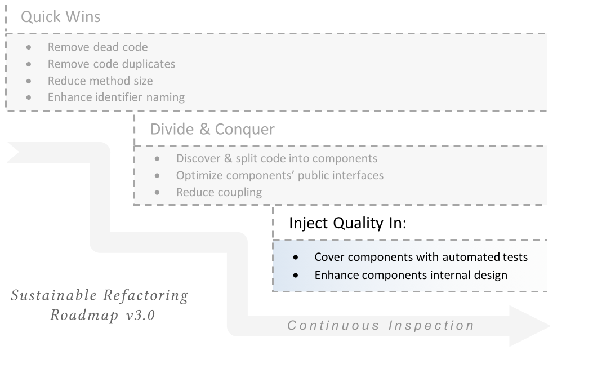
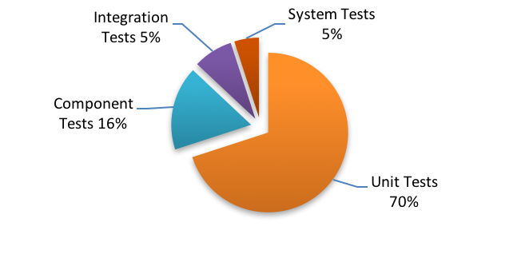

# Stage 3: Inject Quality In

The final stage in the roadmap is to cover components with automated tests and make it self-testing. This, in return, enables the team do more profound and risky refactorings.

## Which type of tests?

There are several types of automated developer tests. The following diagram is a typical distribution of automated tests for a “healthy” product:

**In case of high technical debt and poor code structure, coding unit tests on method level while mocking/faking everything else would have very little Return On Investment (ROI) and would take so much time and effort before the team feels any value.**

**Instead, at this stage, we will concentrate on component, integration, and system tests.** These are the 20% of tests which will realize 80% of the value. Also, there are some other reasons which makes such higher-level tests more appealing:

1. In the previous stage (divide & conquer), we have already prepared component interfaces, and they became ready for getting covered by tests
2. Component tests makes the component code *self-testing*  and raises our confidence in the component interfaces
3. Still, the internal complexity of the component code is high. Remember that we refrained from doing any risky refactorings so far. This is why unit tests may not be feasible at this stage

## Tracking coverage

One of the important considerations to take while refactoring is how will you track this work. As mentioned in the [Ground rules for sustainable refactoring]({#ground-rules}) section, *refactoring effort and outcome should be visible to everybody, including management.* This is particularly important at this stage.

The most famous measure in this stage is test coverage. However, there are several types of test coverage; Line, branch and path coverage.

* **Line coverage** measures the percent lines of code covered by automated tests
* **Branch coverage** measures the percent branches covered by automated tests
* **Path coverage** measures the number of paths/scenarios covered out of the all possible business scenarios

Tracking a single measure is not enough. For example, I can easily achieve 60-70% line coverage, with just 20% path coverage. Also, it's important to review the branches which are not covered. This may give excellent insight about unnecessary conditions in code.
