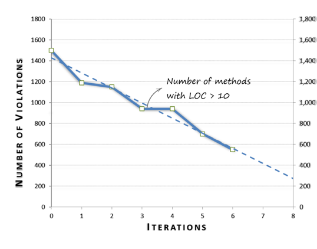

# Measuring Code Quality and Reporting Progress

Measuring code gives you visibility and helps you set clear objectives. As put by Deming:

{icon:quote-left}
B> #### *Without data you’re just another person with an opinion.*
B>
B> \- *- W. Edwards Deming*

Measuring code and making sense of code metrics drives us away from almost all common [failure patterns](#whyrefactoringfails) of code refactoring. Mainly, the are very useful in reporting progress and gain support from busy managers. They also help us visualize areas with highest code issues and maximize the gain of our limited time of work.

In this chapter, I will list some of the code metrics which are invaluable in refactoring. I will also explain how to make sense of these metrics and will give several examples of progress and quality indicators which I used in my previous projects. Finally, I will talk about harmful use of metrics in team evaluation.

## Useful code metrics

Code metrics are useful when they indicate the amount of **code smells** you have in code. It's not enough to measure code, what's important is the kind of smell these metrics detect or surface.

The idea of tracing code metrics to code smells is fundamental and crucial in code refactoring. You may become very easily overwhelmed with the amount of metrics about your code, while you only need a couple of them in this stage of refactoring.

For example, if your code has lots of dead code, you may concentrate on code size and nothing else. If you have so many conditionals, you may focus on the cyclomatic complexity and nothing else. If you are covering code with tests, you may focus on code coverage or even one type of coverage metrics and nothing else.

The next table summarizes some of the important code metrics and how they can be useful and what code smells they expose:

*TABLE 2. A listing of useful code metrics*

{type: table, widths: "10,*,*,10"}
|Metric |Description          |Usage            |Related code smells |
|-----------|--------------|-------|------------------|
|Code size |Can be measured either in lines of code or number of statements. Lines of code excludes whitespace and preferably excludes comments. Number of statements is a better metric because it is not affected by grouping multiple statements on the same line.|Used throughout the product lifecycle. In case of refactoring poor legacy code, we target to reduce this metric till it reaches a stable lower limit. |Large methods. Large Classes. Unused code. Unnecessary code. Extra features.|
|   |   |   |   |
|Methods with size > 10 LOC |Lengthy methods is a sign of poor code. When a method exceed the threshold of 10 lines of code, most probably it violates the Single Responsibility Principle (SRP). Also, lengthy methods are no longer self explanatory and much less maintainable accordingly. It results in multitudes of problems just because of the lengthy methods.   |Should be controlled throughout the project. However, it is so much needed in the Quick-wins stage and specifically in the step: Reducing method size. |Big Methods. Too many conditionals.|
|   |   |   |   |
|Duplication level |Percentage of code duplicated. There are several ways to calculate this number. The idea is to use the same tool and the same set of parameters every time. Basically, this measure takes into account exact and similar clones only.       |Used heavily in the quick-wins stage. We rely on it to assess whether we need to continue working on *removing code duplicates* or not.       |Duplication is the enemy of clean code |
|   |   |   |   |
|Cyclomatic complexity (CC)  |Cyclomatic complexity is an indicator of how execution paths one method has. The more execution paths, the more logic and complexity the method contains.   |Mainly, it's used during the quick-wins to pinpoint big and complex methods which needs to be refactored. Usually, you may find that CC and method length are both high. So, sometimes I prefer to look at the method length first before the CC  |Long Method. Too many conditionals. Switch statement |
|   |   |   |   |
|Code Coverage   |Percentage of code covered by automated tests.   |Used mainly in the *Inject Quality In* stage.    |It helps identify part of code which are not covered by any tests. |
|   |   |   |   |
|Build time   |Time elapsed to build, package and deploy the product.   |This number is used throughout the project lifecycle. In poor legacy code projects, it may be several days of manual effort to package, test, and deploy. The target is to reach a less-than-an-hour process end-to-end   |Long build time. Manual repetitive work.  |
|   |   |   |   |
|Method parameters   |number of parameters in methods.  |Used in the *Divide and Conquer* stage while reviewing and improving the components interfaces.    |Long Parameter List. |
|   |   |   |   |
|Class coupling   |A measure of how many calls back and forth between two classes or packages. It pinpoints high coupling between classes and packages.   |This measure is used mainly in the *Divide and Conquer* stage. It guides you while resolving dependencies and reducing overall coupling in your code.   | Feature Envy. Inappropriate Intimacy. Middle Man. |

## Making sense of code metrics

**A metric is not an indicator**. It doesn't indicate anything. What if I told you that your code size is 1.5 million lines of code. Is this good or bad? Is it a big or small number? No body knows, and it is incorrect to start reasoning using single readings of any metric.

To make sense of code metrics, you need to organize or present them in a visual way which elicit more information about your code. Usually, you need to do one or more of these things:

* **Compare metrics to known benchmarks**. For example, method size is bad when it exceeds 10 LOC
* **Compare metrics to desirable targets.** For example, code coverage should be 100%
* **Relate metrics to each other.** For example, build time relation to module code size.
* **Show the metric trend over time.** For example, burn down for the level of duplication over time.

{icon:bookmark}
B> A metric is just a number, while the indicator is a data visualization technique which tells a story around these numbers.

## Examples of progress/quality indicators

In several refactoring projects, I have used different types of indicators to show progress and assist the team in taking refactoring decisions.

#### Burn up/down charts

One of the most effective techniques was the burn up/down charts, about which Alistair Cockburn says:

{icon:quote-left}
B> “Burn charts have become a favorite way to give visibility into a project’s progress. They are extremely simple and astonishingly powerful”
B>
B> \- *- Alistair Cockburn [^alistair]*

[^kevlin]: Alistair Cockburn, a famous agile author and one of the 17. The quote is from his book: Crystal Clear [20].

#### Tree maps

Tree maps is a way of visualizing the topology of code issues throughout the code packages/namespaces. It is very helpful in visualizing the contribution of code parts to the overall issues in the code.

#### Area graphs

Area graphs are very similar to tree map because they also show the distribution of issues throughout the code parts, but in a different way:

#### Run charts

Run charts are very important because they show the status of code quality over time. They may reveal so much information by analyzing the trend and studying the outliers, if any.

The following is a run chart in one of the refactoring projects I worked on. The code contained more than 52% dead and duplicated code [3]. We started working on removing them but the challenge was to determine when to stop.

We used the following run chart which indicates how much code we remove per one hour of work. This gave us a hint about when to stop working on dead and duplicate code and start working on the next step in the refactoring roadmap:

## Using code metrics for team evaluation

Metrics are very powerful tools. If they are used in the wrong direction, they drive negative behaviors, demotivate individuals, and undermine team values.

**Code metrics should only be used for enhancing code and showing progress, not for anything else.** You should never use them to judge personal capabilities, individual performance, or team productivity, especially if the team is enhancing poor code with already lots of problems. Using code metrics in evaluation and ranking people and teams creates a very unsafe environment and drives negative behaviors. Eventually, you may get better code metrics, but less maintainable code:

{icon:quote-left}
B> *“People with targets and jobs dependent upon meeting them will probably meet the targets – even if they have to destroy the enterprise to do it.”*
B>
B> \- *- W. Edwards Deming*

One example for that is the code size. As a general rule, you should keep your code base simple and remove any unnecessary code. If you reward the behavior of reducing code size (or punish the otherwise behavior), probably you'll get code like this first code sample below, which is three line of code, instead of the second more readable and self-explanatory code sample, which is fourteen lines of code:

{lang=java, line-numbers=on}
~~~~~~~~
public double getSalary(Employee employee) {
	return employee.getBasicSalary() + employee.getChildren().count * (employee.getBasicSalary() * utils.getEduAllownacePer(employee)) + utils.getTransFees(employee.getAddress());
}
~~~~~~~~

Instead of this one:

{lang=java, line-numbers=on}
~~~~~~~~
public double getSalary(Employee employee) {
  double basicSalary = employee.getBasicSalary();
  double educationAllowance = getEducationAllowance(employee);
  double transportationAllowance = utils.getTransFees(employee.getAddress());

  double totalSalary = basicSalary + educationAllowance + transportationAllowance;
  return totalSalary;
}

private double getEducationAllowance(Employee employee){
  int numberOfChildren = employee.getChildren().count;
  double allowancePercentage = utils.getEduAllownacePer(employee);
  return numberOfChildren * (employee.getBasicSalary() * allowancePercentage);
}
~~~~~~~~

This behavior is widespread, and appears in every single organization. This was noted by Eli Goldratt, the father of Theory of Constraints, who said:

{icon:quote-left}
B> *“Tell me how you measure me, and I will tell you how I will behave!”*
B>
B> \- *- Eli Goldratt*

A> #### My story with peer reviews
A>
A> A few years ago, I led product development of a business process management suite. My main responsibilities were technical design, supervision, and mentorship. I used to do code reviews for team members and record what we called *review issues* on our issue tracking tool. Recording issues was very healthy because every now and then we used to collect similar issues, think about their root causes, and take prevention actions to stop them from re-occurring.
A>
A> **Everything was ok till the organization designed an employee appraisal system held twice a year.** Employee's performance is determined by a complicated formula of many contributing measures, and one of these measures was the number of review issues opened on the person's work! After this point of time, I almost stopped reporting review issues on the issue tracking system. Instead, I was leaving my notes on a piece of paper with the person, or sending them by email.
A>
A> Although this broke the continuous improvement cycle I described above, my Inner self convinced me that these issues were very minor and not worth the time of reporting them on the issue tracking, especially if these issues would negatively impact my colleagues' evaluation!
A>
A> **This is an example of the negative subtle effect of metrics in organizations when used for individual evaluation. You may not detect their downsides until the damage is already done in the organization.**
