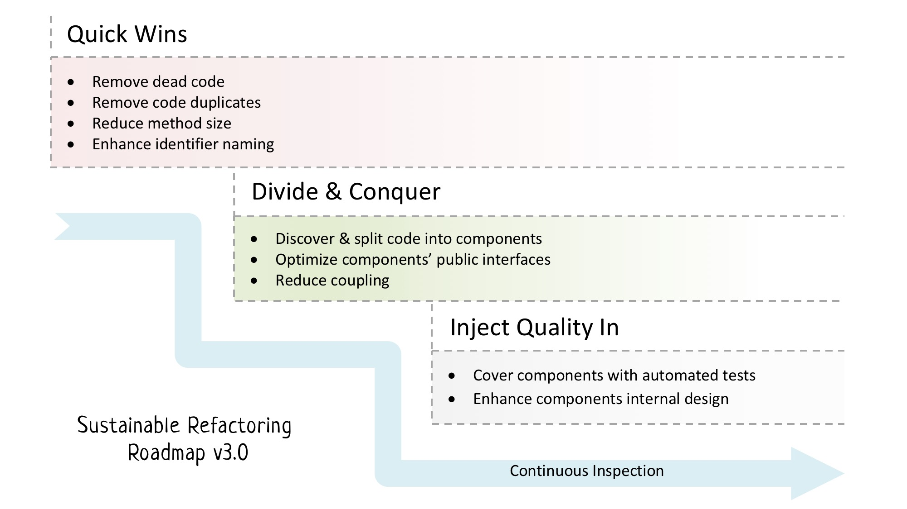
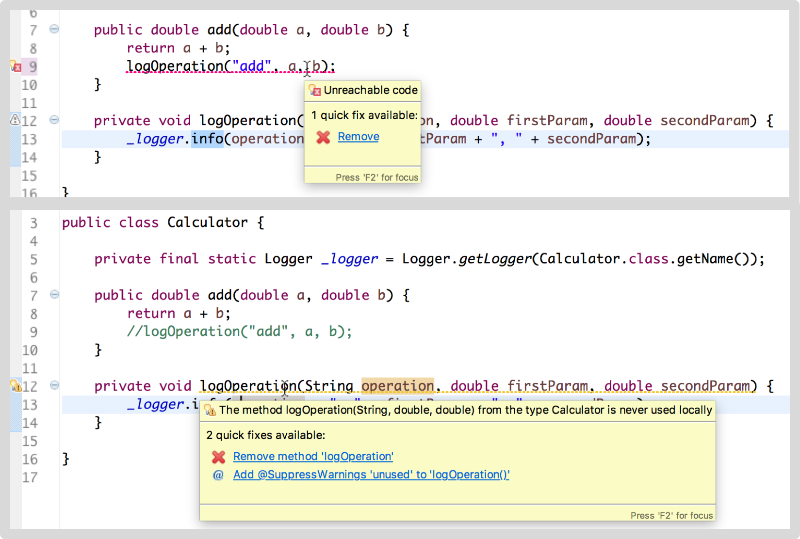
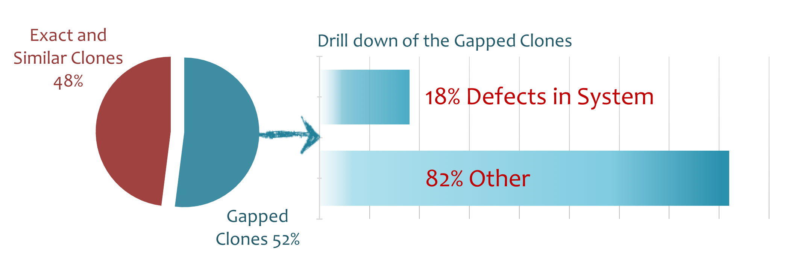
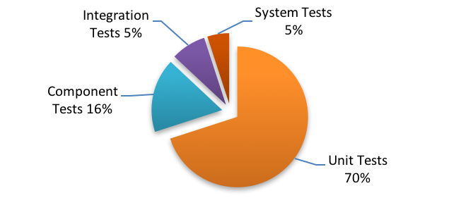

{mainmatter}

# Before you start - Prepare a healthy environment {#beforeYouStart}

## Workitem tracking

## End-to-end traceability

## Production/staging environment readiness

## Continuous integration

# Refactoring Roadmap Overview

## Quick-wins: simple and least risky enhancements

## Divide & Conquer code into components

## Inject quality in using automated tests

# Quick-wins

## Dead code, the time bomb

{icon=quote-left}
G> *Deleting dead code is not a technical problem; it is a problem of mindset and culture*
G>
G> \- Kevlin Henney

It is fairly intuitive to assume that as code grows in size, it needs more maintenance [2]. This can be attributed to three factors:

1. More time needed to analyze code and locate bugs.
2. Larger code implies bigger amount of functionality, which, in turn, requires more maintenance.
3. There is high correlation between size and complexity of software. In the meanwhile, analysis of maintenance effort of business applications shows that highly complex software incurs more costs in maintenance [3]. Accordingly, we can fairly deduce that size is also correlated with maintenance costs.

### What's evil about dead code?

There are many reasons why dead code is bad. First of all, it increases the code size, and thus, as described above, increases the maintenance effort. Have you ever kept staring at a piece of code trying to understand why it is commented out? Did you or anyone of your teammates wasted hours of work trying to locate a bug in a piece of code which turned out to be dead?

While these are very good arguments, there is another reason which makes removing dead code more compelling. [Fortune magazine tells a story](http://fortune.com/2012/08/02/why-knight-lost-440-million-in-45-minutes/) about Knight Capital Group (KCG), which "nearly blew up the market and lost the firm $440 million in 45 minutes". After investigation, it turned out that the code mistakenly set a flag which enabled the execution of a piece of dead code.

This piece of dead code "had been dead for years, but was awakened by a change to the flag’s value. The zombie apocalypse arrived and the rest is bankruptcy" [5].

### How to detect dead code?

So, there are plenty of ways to detect dead code. It is as put by Kevlin, "Deleting dead code is not a technical problem; it is a problem of mindset and culture."

To help you start, here are ideas how to find dead code:

#### Static analyzers

Static analyzers detects unused code by semantic analysis of static code at compile or assembly time. For example:

These are also called *Unreachable Code* and there is other long list of programming errors which may result into unreachable code, like:

* Exception handling code for exceptions which can never be thrown
* Unused parameters or local variables
* Unused default code in switch statements, or switch conditions which can never be true
* Objects allocated and probably does some internal construction logic, but the object itself is never used
* Unreachable cases in if/else statements

All these cases are simple and straight forward to catch using compilers and static analyzers. More examples of tools in the [Catalogue of practices and techniques](#catalogue). However, if your program allows for dynamic code changes, reflection, or dynamic loading of libraries and late binding; in such cases, static analyzers may not help.

#### Files not touched for so long

Search for files that has never changed since a while. "There are many reasons code may be stable:

* it’s just right,
* it’s just dead,
* it’s just too scary

but unless you investigate you’ll never know." [5]

#### Dynamic program analysis

Runtime monitoring and Dynamic program analysis may be used to rule out parts of the code which are **not** dead code. This effectively reduces the amount of code under investigation.

The idea is the same as measuring test coverage. In test coverage, tools help you pinpoint lines of code which are *not covered by any test*. In dynamic program coverage, tools help you pinpoint lines of code which are *never run by users*, either because the features themselves are never used, so you may remove them altogether from your product, or the code is just dead.

---

Removing dead code is a quick win by all means. It doesn't take time and gives a big relief for the team. In my experience, teams take no more than 2-3 days removing crap and end up with this feeling of achievement! On average, in this small period of time, teams manage to remove 4% to 7% (and sometimes 10%) or dead code [4].

## Code duplicates, 'the root of all evil in software!'

{icon=quote-left}
G> *Duplication may be the root of all evil in software*
G>
G> \- Robert C Martin

It is interesting to read what gurus write about code duplication. It is like writing about a plague or a catastrophe which you should avoid by all means.

Andrew Hunt, one of the 17 signatories of the Agile Manifesto, and David Thomas, in their book *"The Pragramtic Programmer"*, have put down several principles for Pragmatic Programming, the first of which is: *Don't Repeat Yourself!*

[SonarQube](https://www.sonarqube.org/), the famous tool for continuous inspection of code quality, lists duplication as one of the *seven deadly sins of developers!*[^Sonar]

[^Sonar]: [Developers' Seven Deadly Sins](https://docs.sonarqube.org/display/HOME/Developers%27+Seven+Deadly+Sins)

Robert C Martin (aka uncle Bob), the famous author, speaker and developer, says that "Duplication may be the root of all evil in software"[^cleancoding]. In another article[^bobarticle], he is no longer hesitant and asserts that "Duplicate code *IS* the root of all evil in software design"

[^cleancoding]: This is mentioned in his famous book: *Clean Code: A Handbook of Agile Software Craftsmanship*

[^bobarticle]: Uncle Bob mentioned this explicitly in his article at infoq: [Robert C. Martin’s Clean Code Tip of the Week #1: An Accidental Doppelgänger in Ruby](http://www.informit.com/articles/article.aspx?p=1313447)

#### What's evil about code duplication

In the introduction, I have mentioned the results of a study about software expenditure. They found that 70 billion of the 100 billion expenditure on software products on a 10-year period were spent on maintenance; and 60% of which is consumed to locate defective code [1]:

This means that duplication magnifies time of locating bugs. If you have a defective piece of code duplicated three times, then it's not enough to find the defect once (this already takes 60% of overall defect handling and resolution time). Rather, you'll need to find each and every copy of this defect anywhere else in the code, which is sometimes simply not possible. what usually happens is that we get an illusion that the bug is fixed upon fixing the first clone, ship the *fixed* software to the customer, who probably become very annoyed and backfire on us that the bug is still there.

#### Why developers copy and paste code?

Well, if code duplication is that evil. Why do we do it all the time? Throughout my career, I noticed developers follow this pattern one way or another:

This is pretty natural. Actually, I myself always followed this pattern and I'm still following it. And, I've been doing excellent work with the teams I worked with. So, where is the problem? The problem is that I used to do a forth step which is necessary and cannot be neglected:

Neglecting this step is a fundamental mistake which rightly is one of the "deadly sins of developers", as put by SonarQube.

#### Type of code clones

There are three types of code clones: *Exact, Similar, and Gapped*. Actually there is a forth type of clones which deals with fragments of code doing the same thing but do not share similar structure (for example, implementing a routine which calculates the factorial of a number, one using for loops and another using recursion). There are lots of efforts in the academia to research whether it is possible to detect type 4 of code clones or not. So, till they reach something tangible, we will stick to the first three types.

In the following sections, all examples of code clones are detected by [ConQAT](https://www.cqse.eu/en/products/conqat/overview/), a **Con**tinuous **Q**u**a**li**t**y monitoring tool developed by the Technical University of Munich.

**Exact Clones**

These are the most straight forward and the easiest to detect type of clones. Here is an example of an exact clone:

**Similar Clones**

Similar clones are more common than exact clones because most probably, when a programmer copies some code, he/she changes or renames some of the variables or parameters names:

As you can see in the above example, clones are similar, except for some renames of identifiers. Note that the structure of the code is the same, and the positions of the renamed identifiers are all the same.

**Gapped Clones (aka inconsistent clones)**

This type of clones are very interesting. It picks exact or similar code with 1-2 change lines of code. These changes are called *Gaps*. Why are they interesting? Because probably they are defects fixed in one location and wasn't fixed in another!

In both above examples, you may need to introspect the code before doing anything. It may be a valid case which should only be available in one clone and not the other.

A> #### Dormant Bugs and Gapped Clones
A> *Dormant bugs* are bugs which have lived some time on production before they are discovered. Recent studies found that 30% of bugs are dormant. This is scary, because this indicates that there are other bugs with each and every deployment which is still not detected. You have no idea when they will fire back; you have no idea what would be the side effects [6].
A>
A> Now, think about gapped clones. These are typically probable dormant bugs on production. Another study shows that the percentage of gapped clones in software systems running in large enterprises are 52%. Among these clones, 18% are system faults or defects [7]:
A>
A> 
A>
A> This means that if you managed to remove 100 gapped clones, then congratulations! You've removed **18 dormant bugs!**

#### Removing code duplicates ####

There are several refactoring techniques for removing duplicate code. The safest and most straight forward technique is to 'Extract Method', and point all duplicates to it. This is relatively a safe refactoring specially if you rely on tool support to automatically extract methods.

In all projects that I've worked on, we were very cautious while removing duplicates. These are several pre-cautions to keep in mind:

* Rely on automatic refactoring capabilities in IDE's to extract methods. Sometime, it is the most obvious mistakes which you may spend hours trying to discover. Relying on automatic refactoring support will reduce or even eliminate such mistakes.
* Any change, what so ever, must be reviewed.

Keeping these two pre-cautions in mind will save you, especially that we are refactoring on the mainline, not on a separate long living branch. More on this in this previous chapter on [how to prepare a healthy environment](#beforeYouStart) section.

---

## Reduce method size

{icon=quote-left}
G> *Refactoring: A change made to the internal structure of software to make it easier to understand and cheaper to modify without changing its existing behavior.*
G>
G> - Martin Fowler [8]

One thing I like about this definition is the clearly-stated objectives of refactoring: to the make software:

1. Easier to understand
2. Cheaper to modify

Having these two objectives in mind, it's possible to develop your "gut feeling" about the correct length of a method.

Let's agree that a method is *maintainable* when it fulfills these two criteria: understandability and modifiability, and need no further refactoring;  Consider this method and try to evaluate how *maintainable* it is. To help you do that, start a stopwatch and measure the time to understand the intent of the method code lines.

{lang="java"}
~~~~~~~~
public List criteriaFind(String criteria) {
  if (criteria == null)
    criteria = "";

  List criteriaList = scanCriteria(criteria);
  List result = new ArrayList();
  Iterator dataIterator = getDataCash().iterator();
  Iterator criteriaIterator = null;
  DataInfo currentRecord = null;
  List currentCriterion = null;
  boolean matching = true;

  while (dataIterator.hasNext() && !interrupted) {
    currentRecord = (DataInfo) dataIterator.next();

    criteriaIterator = criteriaList.iterator();
    while (criteriaIterator.hasNext() && !interrupted) {
      currentCriterion = (List) criteriaIterator.next();
      if (!currentRecord.contains((String) currentCriterion.get(0),
        (String) currentCriterion.get(1))) {
        matching = false;
        break;
      }
    }
    if (matching)
      result.add(currentRecord);
    else
      matching = true;
  }
  if (interrupted) {
    interrupted = false;
    result.clear();
  }
  Collections.sort(result);
  return result;
}
~~~~~~~~

Now, this is a 28-line method. It seems to be a small method. However, you've spent some time (probably around 1-2 minutes) to grasp how the code works. So, according to our definition, Is this method *maintainable*? The answer is no.

Now, consider this enhanced version of the method:

{lang="java"}
~~~~~~~~
public List criteriaFind(String criteria) {
  if (criteria == null)
    criteria = "";

  // convert the criteria to ordered pairs of field/value arrays.
  List criteriaList = scanCriteria(criteria);
  List result = new ArrayList();

  // search for records which satisfies all the criteria.
  Iterator dataIterator = getDataCash().iterator();
  Iterator criteriaIterator = null;
  DataInfo currentRecord = null;
  List currentCriterion = null;
  boolean matching = true;

  while (dataIterator.hasNext() && !interrupted) {
    currentRecord = (DataInfo) dataIterator.next();

    // loop on the criteria; if any criterion is not fulfilled
    // set matching to false and break the loop immediately.
    criteriaIterator = criteriaList.iterator();
    while (criteriaIterator.hasNext() && !interrupted) {
      currentCriterion = (List) criteriaIterator.next();
      if (!currentRecord.contains((String) currentCriterion.get(0),
        (String) currentCriterion.get(1))) {
        matching = false;
        break;
      }
    }
    if (matching)
      result.add(currentRecord);
    else
      matching = true;
  }

  // clear results if user interrupted search
  if (interrupted) {
    interrupted = false;
    result.clear();
  }

  // Sort Results
  Collections.sort(result);
  return result;
}
~~~~~~~~

Adding some comments makes the method somehow more readable. Sometimes, they make it harder to read the code because it overloads the code with more information. But, for this example, it's a bit better.

But, wait a minute. Why are we adding comments? To make the code more readable, right? which indicates that the code is not maintainable, according to our definition. Actually, this is why *explanatory comments* are generally considered a code smell.

Now, let's work on this method. If you notice, comments are placed at perfect places. They give you a hint of the *Boundaries of Logical Units* inside the method. Such logical units are functionally cohesive and are candidate to become standalone methods. Not only that, the comment itself is a perfect starting point for naming of the newly born method.

So, by extracting each chunk into a standalone method, we will reach this version of the method:

{lang="java"}
~~~~~~~~
public List criteriaFind(String criteria) {
  List criteriaList = convertCriteriaToOrderedPairsOfFieldValueArrays(criteria);
  List result = searchForRecordsWhichSatisfiesAllCriteria(criteriaList);
  clearResultsIfUserInterruptsSearch(result);
  sortResults(result);
  return result;
}
~~~~~~~~

This is a 5-line method which narrates a story. No need to write comments or explain anything. It is self-explanatory and much easier now to instantly capture the intent of the code.

A> #### Logical units of code
A>
A> Notice that the original form of the `criteriaFind` method in the above example is functionally cohesive and follows the Single Responsibility Principle (SRP) in a perfect way. However, if you look inside the method, you may notice what I call *Logical Units*, which are single steps in the logic of execution; each step doesn't implement the full job, but still implements a conceivable part towards this goal.
A>
A> Examples of logical units may be an if statement validating a business condition, a for loop doing a batch job on a group of data records, a query statement which retrieves some data from the database, several statements populating data fields on a new form, etc. In my experience, sometimes the logical unit are as small as two or three lines of code. More frequently, they are bigger (like 5 to 12 lines). On very rare occasions I see logical units which are bigger than that.
A>
A> Such logical units are perfect candidates to be extracted into *private* methods. If you adopt this practice for a while, you'll start noticing some private methods which are similar in nature or shares the same "interest". In such case, you may extract and group them into a new logical component. More about this in the [Divide and Conquer](#DivideAndConquer) stage.

## Enhance identifier naming

Identifiers constitute 70% of the characters of your program.

A> #### Explanatory methods and fields

-- Aside for explanatory methods and fields

## Considerations related to the quick-wins stage

### Reliance on tools support

### Are these refactorings safe?

### Should we do them in order?

Yes, with little bit of overlap. This is logical and practical. For example, removing dead code, removes about 10% of your code duplicates[^foo1].

[^foo1]: This is one of our findings. We noticed that a good portion of duplicated code are duplicated and then abandoned. Refer to [4] for more discussion about our findings.

Another example is working on reducing method size before removing duplicates. This actually is a bad practice. Because, you may split a method apart while it is actually a duplicate of another. In this case, you have lost this similarity and may not be able to detect this duplication anymore.

### How to determine whether or not we are done?

# Divide & Conquer {#DivideAndConquer}

## Software design is all about components and their relationships

## Types of software components

## Guiding design principles

# Inject Quality In

The final stage in the roadmap is to cover components with unit tests and create what is called ‘trusted code regions’.

## Which type of tests?

There are several types of automated developer tests. The following diagram is a typical distribution of automated tests for a “healthy” product:

In case of legacy application with poor code structure, coding unit tests on method level while mocking/faking everything else would have very little ROI and would take so much time and effort before the team feels any value.

Instead, at this stage, we will concentrate on component, integration, and system tests. These are the 20% of tests which will realize 80% of the value. Also, there are some other reasons which makes such higher-level tests more appealing:

1. In the previous stage (divide & conquer), we have already prepared component interfaces, and they became ready for getting covered by tests
2. Component tests create what is called ‘trusted code regions’, and divides the overall complexity of testing among components
3. Still, the internal complexity of the component code is still high. Remember that we refrained from doing any risky refactorings so far. This is why unit tests may not be feasible at this stage

## Tracking coverage

# Continuous inspection throughout the roadmap

## Why continuous inspection is important?

## Which conventions should be put under continuous inspection?

## Example: Code clones continuous inspection using Jenkins and ConQAT

# Starting a new project? Important considerations
