# Refactoring Roadmap Overview

Start with high value-add and least risky activities, then work on re-organizing code chunks into components, and finally wrap everything with automated tests. In all stages, automate checks to make sure what is fixed will remain fixed.

{id="refactoring_roadmap"}
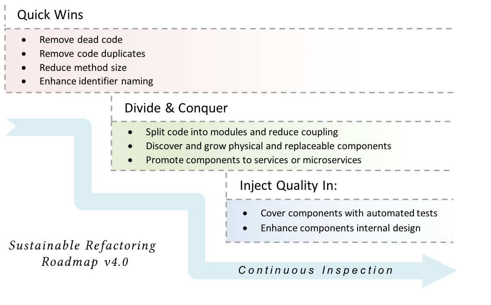

#### Quick-wins: simple and least risky enhancements

In this early stage of refactoring, we rely heavily on tools to detect and fix issues with code. As appears in the roadmap, the kind of issues we are tackling involve the whole code base. So, when we _remove dead code_ or _remove code duplicates_, we do this for the whole code base, not part of the code.

Working on the whole code base magnifies the impact and signifies the improvement. You may put it this way: It may be better to move the whole code one foot forward, rather than to move part of the code a thousand feet forward.

{icon=bookmark}
G> *It may be better to move the whole code one foot forward, rather than to move part of the code a thousand feet forward.*

From my experience, teams working on the quick wins stage for a while usually start feeling "more confident in enhancing the code and applying refactorings ideas". They also have "better grasp and ownership for the code".

#### Divide & Conquer: Split code into components

After getting rid of most of the fat during the last stage, we gradually start introducing structure into the code. The key idea is to move *similar* code together and let components with clear interfaces emerge gradually.

Usually, code is already organized in high level modules. We will keep that and polish the existing modules. However, such modules may have grown in size may be doing so many things for a middle-size code module. Part of these things may be perfect candidate to move to another module, whether a new or existing ones.

#### Inject quality in: Cover components with automated tests

Automated tests is one of the key enablers of quality code. From a development perspective, automated tests empowers the team to refactor entangled code safely. From a customer perspective, automated tests enables fast changes by picking regression bugs early in the process. At this stage in the roadmap, After working on splitting code into components with clear interface methods, it is a perfect timing to start covering components with automated tests.

#### Continuous Inspection

Throughout the roadmap, enabling continuous inspection is key to sustainable refactoring. Continuous inspection ensures that the newly-introduced development habits are kept and enforced. In other words, it ensures that we do not hit the same wall again.

# Quick-Wins

## Removing dead code

{icon=quote-left}
G> *Deleting dead code is not a technical problem; it is a problem of mindset and culture*
G>
G> \- *- Kevlin Henney*

Dead code is the "unnecessary, inoperative code that can be removed without affecting program’s functionality". These include: "functions and sub-programs that are never called, properties that are never read or written, and variables, constants and enumerators that are never referenced, user-defined types that are never used, API declarations that are redundant, and even entire modules and classes that are redundant." [10]

It is fairly intuitive (and was shown empirically) that as code grows in size, it needs more maintenance [4][9]. This can be attributed to three factors:

1. More time needed to analyze code and locate bugs
2. Larger code implies bigger amount of functionality, which, in turn, requires more maintenance
3. Software size has significant influence on quality. That is, as code size increases, code quality decreases. Which, in turn, has significant effect on maintenance cost [9]

### What's evil about dead code?

There are many reasons why dead code is bad. First of all, it increases the code size, and thus, as described above, increases the maintenance effort [4][9]. Do you recall a care at which you kept staring at a piece of code trying to understand why it is commented out? Did you or anyone of your teammates wasted hours of work trying to locate a bug in a piece of code which turned out to be unreachable?

While these are very good arguments, there is another reason which makes removing dead code more compelling. [Fortune magazine tells a story](http://fortune.com/2012/08/02/why-knight-lost-440-million-in-45-minutes/) about Knight Capital Group (KCG), which "nearly blew up the market and lost the firm $440 million in 45 minutes". After investigation, it turned out that the code mistakenly set a flag which enabled the execution of a piece of dead code.

This piece of dead code "had been dead for years, but was awakened by a change to the flag’s value. The zombie apocalypse arrived and the rest is bankruptcy" [5].

### How to detect dead code?

So, there are plenty of ways to detect dead code. It is as put by Kevlin Henney, "Deleting dead code is not a technical problem; it is a problem of mindset and culture." [5]

To help you start, here are ideas how to find dead code:

#### Static analyzers

Static analyzers detects unused code by semantic analysis of static code at compile or assembly time. For example:

These are also called *Unreachable Code* and there is other long list of programming errors which may result into unreachable code, like:

* Exception handling code for exceptions which can never be thrown
* Unused parameters or local variables
* Unused default code in switch statements, or switch conditions which can never be true
* Objects allocated and probably does some internal construction logic, but the object itself is never used
* Unreachable cases in if/else statements

All these cases are simple and straight forward to catch using compilers and static analyzers. More examples of tools in the [Catalogue of practices and techniques](#catalogue). However, if your program allows for dynamic code changes, reflection, or dynamic loading of libraries and late binding; in such cases, static analyzers may not help.

#### Files not touched for so long

Search for files that has never changed since a while. "There are many reasons code may be stable:

* it’s just right,
* it’s just dead,
* it’s just too scary

but unless you investigate you’ll never know." [5]

#### Dynamic program analysis

Runtime monitoring and dynamic program analysis may be used to rule out parts of the code which are **not** dead code. This effectively reduces the amount of code to be inspected.

The idea is the same as measuring test coverage. In test coverage, tools help you pinpoint lines of code which are *not covered by any test*. In dynamic program coverage, tools help you pinpoint lines of code which are *never run by users*, either because the features themselves are never used, so you may remove them altogether from your product, or the code is just dead.

---

Removing dead code is a quick win by all means. It doesn't take time and gives a big relief for the team. In my experience, teams take no more than 2-3 days removing crap and end up with this feeling of achievement! On average, in this small period of time, teams manage to remove 4% to 7% (and sometimes 10%) of dead code [2].

## Removing code duplicates

{icon=quote-left}
G> *Duplication may be the root of all evil in software*
G>
G> \- *- Robert C. Martin*

It is interesting to read what gurus write about code duplication. It is like writing about a plague or a catastrophe which you should avoid by all means.

Andrew Hunt, one of the 17 signatories of the Agile Manifesto, and David Thomas, in their book *"The Pragramtic Programmer"*, have put down several principles for Pragmatic Programming, the first of which is: *Don't Repeat Yourself!*

[SonarQube](https://www.sonarqube.org/), the famous tool for continuous inspection of code quality, lists duplication as one of the *seven deadly sins of developers!*[^Sonar]

[^Sonar]: [Developers' Seven Deadly Sins](https://docs.sonarqube.org/display/HOME/Developers%27+Seven+Deadly+Sins)

Robert C Martin (aka uncle Bob), the famous author, speaker and developer, says that "Duplication may be the root of all evil in software"[^cleancoding]. In another article[^bobarticle], he is no longer hesitant and asserts that "Duplicate code *IS* the root of all evil in software design"

[^cleancoding]: This is mentioned in his famous book: *Clean Code: A Handbook of Agile Software Craftsmanship*

[^bobarticle]: Uncle Bob mentioned this explicitly in his article at infoq: [Robert C. Martin’s Clean Code Tip of the Week #1: An Accidental Doppelgänger in Ruby](http://www.informit.com/articles/article.aspx?p=1313447)

#### What's evil about code duplication

In the introduction, I have mentioned the results of a study about software expenditure. They found that 70 billion of the 100 billion expenditure on software products on a 10-year period were spent on maintenance; and 60% of which is consumed to locate defective code [1]:

This means that duplication magnifies time of locating bugs. If you have a defective piece of code duplicated three times, then it's not enough to find the defect once (this already takes 60% of overall defect handling and resolution time). Rather, you'll need to find each and every copy of this defect anywhere else in the code, which is sometimes simply not possible. what usually happens is that we get an illusion that the bug is fixed upon fixing the first clone, ship the *fixed* software to the customer, who probably become very annoyed and backfire on us that the bug is still there.

#### Why developers copy and paste code?

Well, if code duplication is that evil. Why do we do it all the time? Throughout my career, I noticed developers follow this pattern one way or another: Copy Some code, change it to suite your new requirement, and finally test all changes.

This is pretty natural. Actually, I myself always followed this pattern and I'm still following it. And, I've been doing excellent work with teams I worked with. So, where is the problem? The problem is that I always do a forth step which is necessary and cannot be neglected, which is refactoring. It's ok to copy and paste code only if you're going to refactor this code later on.

Neglecting this step is a fundamental mistake which rightly is one of the "deadly sins of developers", as put by SonarQube.

#### Type of code clones

There are four types of code clones: *Exact, Similar, Gapped, and Semantic*. In the following sections, we will only shed light on each of them to help you detect and remove them mercilessly!

Note: All examples of code clones are detected by [ConQAT](https://www.cqse.eu/en/products/conqat/overview/), a **Con**tinuous **Q**u**a**li**t**y monitoring tool developed by the Technical University of Munich.

**Type 1: Exact Clones**

These are the most straight forward and the easiest to detect type of clones. Here is an example of an exact clone:

**Type 2: Similar Clones**

Similar clones are more common than exact clones because most probably, when a programmer copies some code, he/she changes or renames some of the variables or parameters names:

As you can see in the above example, clones are similar, except for some renames of identifiers. Note that the structure of the code is the same, and the positions of the renamed identifiers are all the same.

**Type 3: Gapped Clones (aka inconsistent clones)**

This type of clones are very interesting. It picks exact or similar code with 1-2 change lines of code. These changes are called *Gaps*. Why are they interesting? Because probably they are defects fixed in one location and wasn't fixed in another!

In both above examples, you may need to introspect the code before doing anything. It may be a valid case which should only be available in one clone and not the other.

**Type 4: Semantic clones**

The forth type of clones deals with fragments of code doing the same thing but do not share similar structure. For example, implementing a routine which calculates the factorial of a number, one using for loops and another using recursion. There are lots of efforts in the academia to research whether it is possible to detect type 4 of code clones or not. Till they reach something tangible, we will work on the first three types.

A> #### Dormant Bugs and Gapped Clones
A> *Dormant bugs* are bugs which have lived some time on production before they are discovered. Recent studies found that 30% of bugs are dormant. This is scary, because this indicates that there are other bugs with each and every deployment which is still not detected. You have no idea when they will fire back; you have no idea what would be the side effects [6].
A>
A> Now, think about gapped clones. These are typically probable dormant bugs on production. Another study shows that the percentage of gapped clones in software systems running in large enterprises are 52%. Among these clones, 18% are system faults or defects [7]:
A>
A> 
A>
A> This means that if you managed to remove 100 gapped clones, then congratulations! You've removed **18 dormant bugs!**

#### Removing code duplicates ####

There are several refactoring techniques for removing duplicate code. The safest and most straight forward technique is to 'Extract Method', and point all duplicates to it. This is relatively a safe refactoring specially if you rely on tool support to automatically extract methods.

In all projects that I've worked on, we were very cautious while removing duplicates. These are several pre-cautions to keep in mind:

* Rely on automatic refactoring capabilities in IDE's to extract methods. Sometime, it is the most obvious mistakes which you may spend hours trying to discover. Relying on automatic refactoring support will reduce or even eliminate such mistakes.
* Any change, what so ever, must be reviewed.

Keeping these two pre-cautions in mind will save you, especially that we are refactoring on the mainline, not on a separate long living branch. More on this in this previous chapter on [how to prepare a healthy environment](#beforeYouStart) section.

## Reduce method size

{icon=quote-left}
G> *Refactoring: A change made to the internal structure of software to make it easier to understand and cheaper to modify without changing its existing behavior.*
G>
G> \- *- Martin Fowler [8]*

One thing I like about this definition is the clearly-stated objectives of refactoring: to the make software:

1. Easier to understand
2. Cheaper to modify

Having these two objectives in mind, it's possible to develop your "gut feeling" about the correct length of a method.

Let's agree that a method is *maintainable* and needs no further refactoring when it fulfills these two criteria of being understandable and modifiable. Now, consider this method and try to evaluate how *maintainable* it is. To help you do that, start a stopwatch and measure the time to understand the intent of the method code lines.

{lang="java"}
~~~~~~~~
public List criteriaFind(String criteria) {
  if (criteria == null)
    criteria = "";

  List criteriaList = scanCriteria(criteria);
  List result = new ArrayList();
  Iterator dataIterator = getDataCash().iterator();
  Iterator criteriaIterator = null;
  DataInfo currentRecord = null;
  List currentCriterion = null;
  boolean matching = true;

  while (dataIterator.hasNext() && !interrupted) {
    currentRecord = (DataInfo) dataIterator.next();

    criteriaIterator = criteriaList.iterator();
    while (criteriaIterator.hasNext() && !interrupted) {
      currentCriterion = (List) criteriaIterator.next();
      if (!currentRecord.contains((String) currentCriterion.get(0),
        (String) currentCriterion.get(1))) {
        matching = false;
        break;
      }
    }
    if (matching)
      result.add(currentRecord);
    else
      matching = true;
  }
  if (interrupted) {
    interrupted = false;
    result.clear();
  }
  Collections.sort(result);
  return result;
}
~~~~~~~~

This is a 28-line method. It seems to be a small method. However, you've spent some time (probably around 1-2 minutes) to grasp how the code works. So, according to our definition, Is this method *maintainable*? The answer is no.

Now, consider this enhanced version of the method:

{lang="java"}
~~~~~~~~
public List criteriaFind(String criteria) {
  if (criteria == null)
    criteria = "";

  // convert the criteria to ordered pairs of field/value arrays.
  List criteriaList = scanCriteria(criteria);
  List result = new ArrayList();

  // search for records which satisfies all the criteria.
  Iterator dataIterator = getDataCash().iterator();
  Iterator criteriaIterator = null;
  DataInfo currentRecord = null;
  List currentCriterion = null;
  boolean matching = true;

  while (dataIterator.hasNext() && !interrupted) {
    currentRecord = (DataInfo) dataIterator.next();

    // loop on the criteria; if any criterion is not fulfilled
    // set matching to false and break the loop immediately.
    criteriaIterator = criteriaList.iterator();
    while (criteriaIterator.hasNext() && !interrupted) {
      currentCriterion = (List) criteriaIterator.next();
      if (!currentRecord.contains((String) currentCriterion.get(0),
        (String) currentCriterion.get(1))) {
        matching = false;
        break;
      }
    }
    if (matching)
      result.add(currentRecord);
    else
      matching = true;
  }

  // clear results if user interrupted search
  if (interrupted) {
    interrupted = false;
    result.clear();
  }

  // Sort Results
  Collections.sort(result);
  return result;
}
~~~~~~~~

Adding some comments are generally perceived to enhance code understandability. It may clutter the code a bit, but at least in this example, the code is a little more readable. But, wait a minute, if we are adding comments to make the code more readable, isn't this an indication that the code is not maintainable, according to our definition? The answer is yes. This is why *explanatory comments* are generally considered a code smell, or a sign of bad code.

{icon=bookmark}
G> *If we are adding comments to make the code more readable, isn't this an indication that the code is not maintainable, according to our definition? The answer is yes. This is why __explanatory comments__ are generally considered a code smell, or a sign of bad code.*

Now, let's work on this method. If you notice, comments are placed at perfect places. They give you a hint of the *Boundaries of Logical Units* inside the method. Such logical units are functionally cohesive and are candidate to become standalone methods. Not only that, the comment itself is a perfect starting point for naming of the newly born method.

So, by extracting each chunk into a standalone method, we will reach this version of the method:

{lang="java"}
~~~~~~~~
public List criteriaFind(String criteria) {
  List criteriaList = convertCriteriaToOrderedPairsOfFieldValueArrays(criteria);
  List result = searchForRecordsWhichSatisfiesAllCriteria(criteriaList);
  clearResultsIfUserInterruptsSearch(result);
  sortResults(result);
  return result;
}
~~~~~~~~

This is a 5-line method which narrates a story. No need to write comments or explain anything. It is self-explanatory and much easier now to instantly capture the intent of the code.

I have done this experiment before, to give the three variants of the method above, without comments, with comments, and refactored into small method. I have measured the time it takes a person to understand the intent of the method. Results were as follows:

* Method without comments: ~ 2 minutes
* Method with comments: ~ 1 minute
* Refactored short method: ~ 10 seconds

It is stunning How much time you save by just reducing methods into smaller size with readable method names. It hits the hard of the refactoring effort: to make the code *"easier to understand and cheaper to modify"*.

A> #### Logical units of code
A>
A> Notice that the original form of the `criteriaFind` method in the above example is functionally cohesive and follows the Single Responsibility Principle (SRP) in a perfect way. However, if you look inside the method, you may notice what I call *Logical Units*, which are single steps in the logic of execution; each step doesn't implement the full job, but still implements a conceivable part towards this goal.
A>
A> Examples of logical units may be an if statement validating a business condition, a for loop doing a batch job on a group of data records, a query statement which retrieves some data from the database, several statements populating data fields on a new form, etc. In my experience, sometimes the logical unit are as small as two or three lines of code. More frequently, they are bigger (like 5 to 12 lines). On very rare occasions I see logical units which are bigger than that.
A>
A> Such logical units are perfect candidates to be extracted into *private* methods. If you adopt this practice for a while, you'll start noticing some private methods which are similar in nature or shares the same "interest". In such case, you may extract and group them into a new logical component. More about this in the [Divide and Conquer](#DivideAndConquer) stage.

## Enhance identifier naming

{icon=quote-left}
G> *You know you are working on clean code when each routine you read turns out to be pretty much what you expected[^clean-ron]*
G>
G> \- *- Ron Jeffries*

In an interesting study titled: *Concise and Consistent Naming*, the authors has conducted token analysis on Eclipse 3.0 code, and found that *"Approximately 70% of the source code of a software system consists of identifiers"*:

This is why "the names chosen as identifiers are of paramount importance for the readability of computer programs and therewith their comprehensibility" [17]. Imagine that every class, method, parameter, local variable, every name in your software is indicative and properly named, imagine how readable your software will become.

The good news is that renaming is a low hanging fruit that we can do with minimal side effects, especially if automated *Rename* refactoring is used.

A> #### Explanatory methods and fields
A>
A> < under development - put here the example of bubble sort>

[^clean-ron]: Quoted in *Leading Lean Software Development: Results Are not the Point*, by Mary and Tom Poppendieck.

## Considerations related to the quick-wins stage

#### Avoid introducing inheritance trees

One tempting technique to remove duplication is to introduce a parent type and gather common behavior among two or more child types:

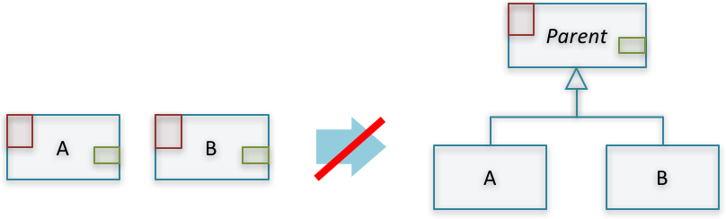

In general, I prefer composition over inheritance. Inheritance hierarchies are notorious for their complexity and difficulty of understanding polymorphic behavior of sub-types. Moreover, they are especially not recommended at this very early stage of refactoring.

Instead, you may chose one of the following three simple alternatives:

1. *Inline Classes* into one class, especially if the coupling and/or level of duplication is high between the two of them.
1. *Extract Methods* in class B and reuse them in class A. This creates a dependency on B, which may or may not be a bad thing.

    

1. If coupling between A and B is bad, then *Extract Methods* in A and then chose whether to *Move Methods* to an existing class, or *Extract Class*, a new class C. In both cases, A and B will depend on the common class:

    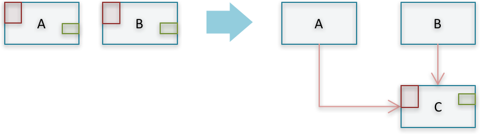

A> #### Why we should favor composition over inheritance
A>
A> This is a controversial topic since the inception of object-oriented design. A lot has been said about when to use inheritance and whether you should favor composition and when. However, it seems there is a general "impression" that over use of inheritance causes problems and deteriorates program clarity; something which we are already trying to enhance. Here are some references:
A>
A> * The GOF book, way back in 1995, advices us to "Favor 'object composition' over 'class inheritance'." They rightly argue that "because inheritance exposes a subclass to details of its parent's implementation, it's often said that 'inheritance breaks encapsulation'" [12]
A> * Eric S. Raymond, in his book *The Art of Unix Programming*, argues that the over use of inheritance introduces layers in code and "destroys transparencies" [13]. I absolutely agree on this. From my experience, looking for a bug in a pile of inheritance hierarchy with five or six layers of polymorphic behavior is like searching for a needle in a haystack!
A>
A> Im many cases, using composition with the [Strategy pattern](https://en.wikipedia.org/wiki/Strategy_pattern) hits a sweet sport between composition and inheritance. Consider this example: We are building a car system simulator in which a car may have two breaking systems: standard and ABS. In this case, it may be straight forward to use inheritance:
A>
A> 
A>
A> Now, consider adding a capability to simulate two steering systems: Power and Electric. If we continue using inheritance, we will have to introduce duplication, the enemy of clean code. In the example, the logic of power steering is now duplicated in both `PowerSteeringAbsBrakingCar` and `PowerSteeringStandardBrakingCar`, and the logic of electric steering is duplicated in both `ElectricSteeringAbsBrakingCar` and `ElectricSteeringStandardBrakingCar`
A>
A>
A> 
A>
A> Instead, let's collapse this inheritance tree, and use composition with the Strategy pattern. Here, we will design a Car with many components, each component is an *abstract strategy* which may have several *concrete implementations*:
A>
A> 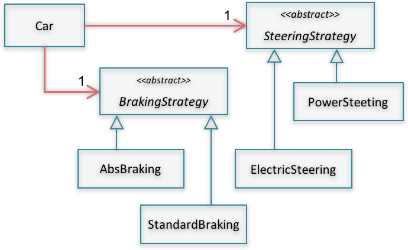

#### Always rely on tools support

One important consideration in this stage is that **no manual refactoring is allowed!**. Detecting dead code, detecting and removing code clones, extracting methods to reduce method size, renaming identifier names; you can do all such activities with the assistance of strong IDE features or add-on tools.

Using automated refactoring tools contributes to safety and makes developers more confident when dealing with poor and cluttered code

#### Should we do them in order?

Yes, with little bit of overlap. This is logical and practical. For example, removing dead code, removes about 10% of your code duplicates[^deadcode].

[^deadcode]: This was validated in one of our experiments. We found that removing dead code removes also 10% of duplicate code [2]. This is totally reasonable, because a good portion of duplicated code are duplicated and then abandoned.

Another example is working on reducing method size before removing duplicates. This actually is a bad practice. Because, you may split a method apart while it is actually a duplicate of another. In this case, you have lost this similarity and may not be able to detect this duplication anymore.

#### How to determine whether or not we are done?

< under development >

#### Are these refactorings safe?

< under development >

# Divide and Conquer {#DivideAndConquer}

Software design is all about components and their relationships. The better you divide your software into loosely-coupled and highly-cohesive parts, the more comprehensible, more responsive to change, and more agile your software design becomes. The act of partitioning your software in such manner is described by Fairbanks as authoring "a story at many levels", which results in a software design that will "tell a story to whoever looks at it, and it will be easy to understand":

> *"To be comprehensible, your software should be structured so that it reveals a story at many levels. Each level of nesting tells a story about how those parts interact. A developer who was unfamiliar with the system could be dropped it at any level and still make sense of it, rather than being swamped."*
>
> \- George Fairbanks [14]

Now, here is a question: If software partitioning is that important, why didn't we start with it right away in the [refactoring roadmap](#refactoring_roadmap)?

We can describe what we achieved so far as removing "fat" from the application's body of code; namely, removing dead code, and reducing code duplication, plus applying some very basic and intuitive enhancements which makes the code slightly more readable, like reducing method size and using proper naming conventions. This is like *preparing the scene* or *organizing our backyard* before we start on re-organizing the parts. And, this has two very important side effects:

1. We have saved the time that we would have spent working on dead or duplicate code.
2. The team reached a better grasp of the code while scanning and reviewing duplicates and suspect dead code. They formed better understanding while breaking up large methods and trying to give better names to identifiers and code constructs

I have noticed the effect in the second point above many times while working with teams on refactoring. As I explained before in the Introduction and Background section, teams become more courageous and bold in enhancing the code especially after the quick-wins stage.

In this stage, introducing structure is the goal. Although all the enhancements in the quick-wins stage made the code *better*, but still *lacks structured* and the mission now is discovering/uncovering components and enhance their interfaces:

## Guiding design principles

#### Abstraction

< under development >

#### Stepwise refinement

< under development >

#### Modularity

< under development >

#### Information hiding (or Encapsulation)

< under development >

#### Simplicity

< under development >

#### Coupling and Cohesion

Cohesion "measures the degree of connectivity among the elements of a single module" [grady booch, object oriented analysis and design]

< under development >

## Modules, components, or services?

First, we need to answer this question: Are we splitting our code into modules, components, or services? Before we do that, let's agree on what a module, component, and service is.

#### Module

The *UML User Guide* provided a very brief and broad definition of what a module is. It is a *"software unit of storage and manipulation"*.

To elaborate on this definition, a module is any logical grouping of cohesive code functions which provides access to these functions in a uniform manner. This can be as big as a sub-system, like an accounting or HR module, or as small as a class, like a calculator or an xml parser.

#### Component

{icon=quote-left}
G> *“A component is a physical and replaceable part of a system that conforms to and provides the realization of a set of interfaces. It is intended to be easily substitutable for other components that meet the same specifications.”*
G>
G> \- *- The UML User Guide*

From this definition, we understand that a component is a physical standalone file; a jar, war, dll, gem, etc. Also, it is replaceable, meaning that it can be deployed/redeployed on its own. Also, we understand that a component may contain one or more smaller modules; and vice versa, a big module may contain one or more components.

#### Service

In essence, web services (or just services), are components. They are physical, replaceable, provides clear interfaces, and easily substitutable. However, there is value in differentiating services from components.

{icon=quote-left}
G> *“A service is similar to a component in that it's used by foreign applications. The main difference is that I expect a component to be used locally (think jar file, assembly, dll, or a source import). A service will be used remotely through some remote interface, either synchronous or asynchronous (eg web service, messaging system, RPC, or socket.)”[^fowler_article]*
G>
G> \- *- Martin Fowler*

[^fowler_article]: This quote is from Martin's article: [Inversion of Control Containers and the Dependency Injection pattern](https://www.martinfowler.com/articles/injection.html). For other interesting distinctions between components and services, please refer to Martin's famous article: [Microservices: a definition of this new architectural term](https://martinfowler.com/articles/microservices.html)

One very important difference between a component and a service is that a component cannot run on its own. It has to be integrated in a bigger whole to achieve any value out of it. Unlike a service, which is available and standalone. It can be located and used whether on its own or as part of a bigger application.

---

So, what's the value of outlining these differences between modules, components, and services?

As you may noticed from the past definitions, there are higher level of decoupling and increased formality in defining interfaces when moving from modules to components to services.

Modules may co-exist in the same (physical) deployable package; unlike components or services, which are physically standalone.

Modules and components run typically in the same process; unlike services, which runs every service in its own process. Modules and components may communicate through in-memory method calls, while services may require inter-process communication through web-service requests or remote procedure calls.

So, Services enjoys the maximum level of decoupling. You can view them as standalone applications which could be glued together in order to provide greater value for some end user.

Now, the questions is: *Do we need to divide our code into modules or components or services?* The only answer that I can provide is: Divide the code into modules. Then, assess whether or not it is useful and safe to upgrade them to components or services.

{icon=bookmark}
G> *Divide the code into modules. Then, assess whether or not it is **useful AND safe** to upgrade them to components or services.*

A> ## What about Microservices?
A>
A> In the above discussion, I have talked about web-service (or just services). The main difference between services and microservices is that services share a common datastore, whereas each microservice has a separate standalone datastore.
A>
A> When looking from the angle of refactoring legacy or monolithic application code bases, it is not feasible to exert any effort or even think about splitting a large backend database into smaller ones and move towards a microservices architecture. Some other challenges looms in the way like handling distributed transactions and understanding and supporting the call chain for every business transaction[^nealford].
A>
A> This is why I have intentionally omitted microservices as one of the options to which one can upgrade newly-born components. In stead, a middle-way is a course-grained service, following a service-based architecture of some kind.

[^nealford]: More discussion about why microservice architecture is not suitable when refactoring monolithic applications is at this excellent talk by Neal Ford: [Comparing service-based architectures](https://vimeo.com/163918385).

## Componentization - Moving from spaghetti/cluttered code to components

The journey from cluttered code to module, components, or services is progressive and multi-stage. Code with large amount of technical debt usually looks like this figure. No clear boundaries between modules, high level glimpses of module interfaces, unstructured or unbounded module communication, etc.

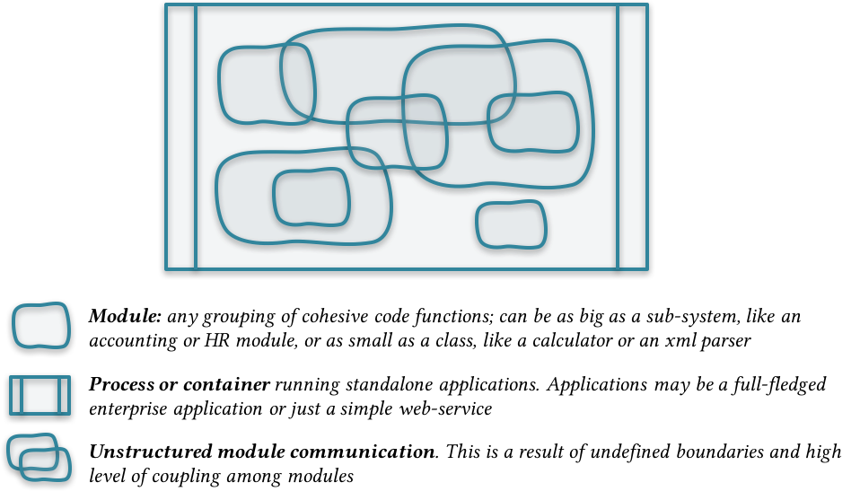

Gradually, we start moving methods and classes around to let modules emerge and become more apparent. Remember, only safe refactoring with support of an automated refactoring tools are allowed. In most of the cases, you can depend on the following refactorings:

* Move Method
* Move Class
* Rename
* Extract Class
* Extract Interface
* Extract Method

This results in clearer module boundaries and better manifestation of module interfaces.

Next, we should concentrate on more decoupling modules and create a solo-deployable components. At this stage, we should work more on polishing interfaces, move away un-needed interface methods and interface parameters. Some useful refactorings at this stage are:

* Change Method Signature (to remove or reorder method parameters)
* Introduce Parameter or Parameter Object
* Turn Public Methods Private

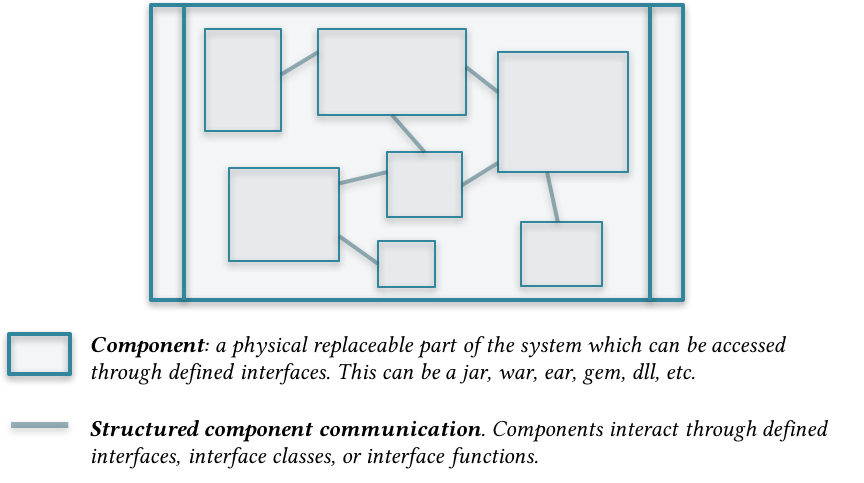

You may stop at this stage. Or, you move to the next step and turn components into services. Remind you that you may chose to do so only if you find it *valuable and safe*.

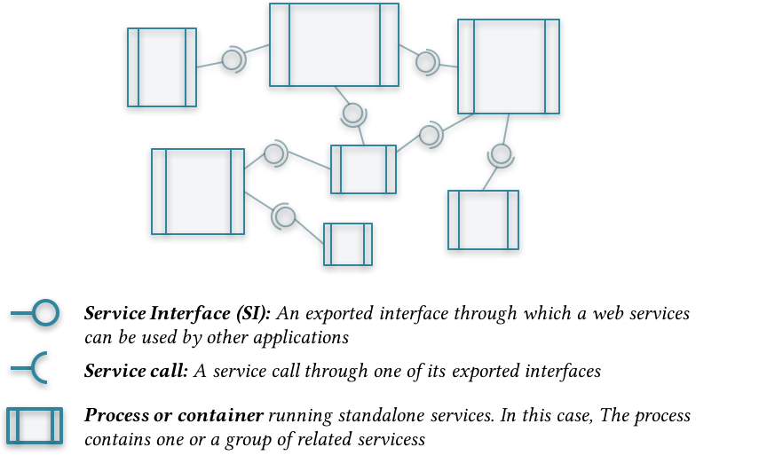

## Types of software components - Strategies for breaking code apart

This section is a primer about types of software components. As you may expect, software components may take some universal types which many experienced developers have noted. This will help you detect/uncover modules and enhance your code structure more effectively and efficiently. In this section, we will cover these types of software modules/components:

* Functional (or business)
* Utility
* Port
* View
* Archtypes (or Code types)
* Architectural style

Before we do that, These are two guidelines for breaking code apart:

> *Guideline 1: Group similar code together!*

But, what if the component gets very large, the answer is a second guideline:

> *Guideline 2: If a module becomes large, look for similar code inside it, and reapply the first guideline.*

Note that determining whether or not a component is large is a subjective decision. In the meanwhile, There 3-30 "rule of thumb" may give indication whether a module or component is becoming big. It states that a module may provide at least 3 and at most 30 interface methods or functions.

#### Functional (or Business)

The first thing to think about while grouping similar code together is the business functions. The reason is that they are the easiest to detect and results in the most cohesive module type. The strategy of partitioning code according to business function results in a system abstraction which is more comprehensible and easier to read and understand.

#### Utility

When grouping business functions together, you'll notice parts of the code doing some redundant type of work. Sometimes, this is part of the business function itself, like `validateEmployeeId` for validating an multi-part employee id is correctly formed; or `formatEmployeeName` for preparing a special print name of employees based on their name, department, and hiring date. For this type of redundancy, No need to move them to a separate module.

In other cases, you may detect utility functions which are distinctive and may not relate to the core business functionality. These are some examples of utility functions:
* Standard mathematical or string calculations, like `calculatePercentage(base, percent)` for calculating a percentage out of a base number, or `divideFullNameIntoParts` which returns person first to last names organized into an array
* Batch operations on collections of raw data, like `multiplyByPercent`, which receives a collection of values and returns the same set multiplied by a parameter value.

* Reading or writing records from an excel file.
* Parsing XML or JSON structures
* etc.

In these cases, the first step is to group all utility functions in a separate generic "utility" module or class. Then, revisit this module and see what groups of utilities emerged and need to be grouped in a separate more cohesive utility class:

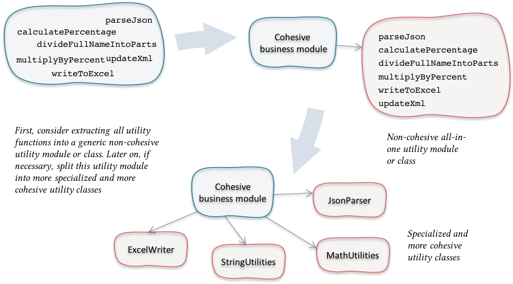

#### Port

Port modules are those which encapsulate communication logic to and from a special resource. For example, communicating with web-services, RMI/IIOP, databases, file system, network resources, etc. So, any type of communication which may be needed by more than one *functional modules* should be encapsulated in a standalone module.

Port modules may be considered a subtype of the *Utility modules* because at the end of the day, a port module is a group of utility functions specialized to do a logical job. Even though, I find it very important to think about port modules as a separate type for two reasons:

* Sometimes, it encapsulates some business logic related to how objects or data are prepared or serialized before sending or after receiving. So, it may not be pure utility functions.
* This type is almost in all applications and is very commonly used every where. This is why it deserves a special type.

#### Archtypes (or Core types)

Archtypes are the most noticeable or important data types [14]. Usually, these types are gathered in one core module used by almost all others. Although this raises coupling between this module and the rest of the system, gathering core types in one module reduces the overall coupling among all other modules in the system.

#### View

Any software with a graphical user interface needs one or more view modules. Usually, views are tightly coupled with its corresponding functional modules; therefore, it is tempting to package them together in one deployable component. On the other hand, the *Release Reuse Equivalency Principle* states that *"The granule of reuse is the granule of release"* [15]. Meaning that you should keep an eye on how your components are reused. If part on the component is reused more than another, then it should be placed in a separate deployable release, or component.

The *Common Closure Principle* gives another dimension. It states that: *"Classes that change together are packaged together"* [15]. Sometimes, change in business requires a change in view and vice versa. In this case, following the principle, you should keep them together. In contrast, if the changes are usually confined to view or business, you should place each one of them in a separate component.

#### Architectural style

This is one way of partitioning your code: following an architectural style [14]. If you're maintaining a heavy transactional system, a banking system for instance, then probably it will follow a *Transaction Processing* style [16]. In this architectural style, transactions are recorded and processed later on. This is a high level diagram of typical components in transaction processing application:

* Transaction Input: Typically a view or port component
* Transaction Dispatcher: A mediator component responsible for dispatching logged transaction to processors
* Transaction Handlers: Components for processing different types of transactions

As you may notice, these components can sometimes be considered functional (Transaction Handlers), Port or View (Transaction Input), or Utility (Dispatcher). Even though, the reason of their existence is the architectural style itself; and components and relationships are defined to fulfill a set of constraints and promote some pre-defined system quality attributes. This is why these components are put under this category.

In most cases, you may find glimpses of these architectural styles while you are refactoring old code. Try to honor this structure and enhance its encapsulation.

## A walk through an example

< under development >

## Considerations while breaking code apart

#### Break circular (aka cyclic) dependencies

Circular dependencies occurs when one component depends on another component which in turn depends directly or indirectly on the first one:

You can live with circular dependencies for some time. However, in the long term your code may become very complex with higher levels of coupling between components. In time, this will result in more regression type of defects, upfront load time, and possible memory leaks due to cyclic references which never releases used objects. A perfect recipe for how to create spaghetti code!

Here are some strategies to break circular dependencies:

1. Move variable/method/class to the dependent component. This should always be the first solution to think about, because very often this variable or method was created by a lazy programmer who didn't bother to place things in the proper place. Using an IDE's automated refactoring for moving things around would be the safest, fastest, and cleanest solution.

    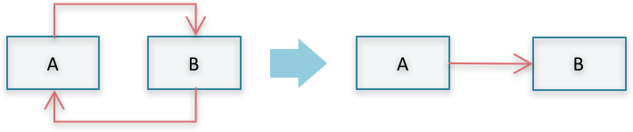

1. Extract common logic into a standalone component, on which both original components depend

    

1. Apply the Dependency Inversion Principle[^solid], which states that *High-level modules should not depend on low-level modules. Both should depend on abstractions.* To do that, split one component (component B in the example below) into two components: One holds the abstractions (or the generic definitions of types and interfaces) and the other provides the concretions (or one default implementation). Then, component A and B depends on the newly-cerated component C.

    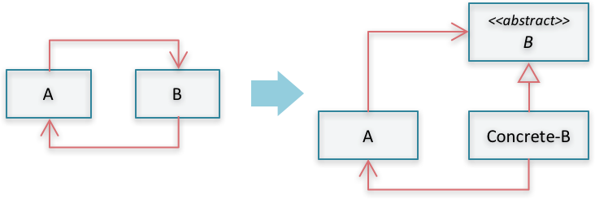

1. Make use of some architectural patterns, like the Observer pattern. In my experience, this may be considered a large refactoring at this stage and breaks the [ground rules](#ground_rules) upon which we have agreed at the beginning of this book. In stead, I would resort to one of the previous two solutions.

[^solid]: This is the sixth principle of the famous SOLID principles of object oriented design by Robert C. Martin [11]

#### Start from (and honor) existing architecture

Developers tend to deviate from existing initial architecture for many reasons; for lack of design clarity, insufficient documentation, or emergent design consideration which was not handled before. The volume of these "violations" to initial architecture was found to be from 9% to 19% of all dependencies in the system for healthy project (projects with updated reference architecture) [17].

For poor and cluttered projects, the percentage is much higher. The diagrams below present the amount of violations found in two projects I worked with. What we have done is that we have first drawn the architectural modules and the expected dependencies between them. Then, we have used ConQat [^conqat] to check the architecture validity and detect any violations:

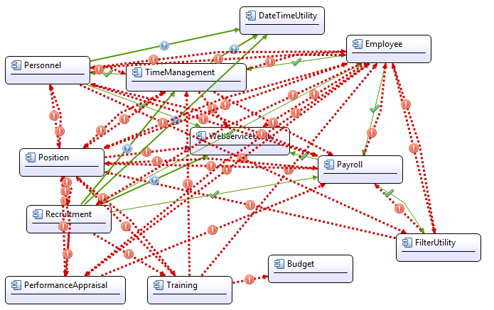

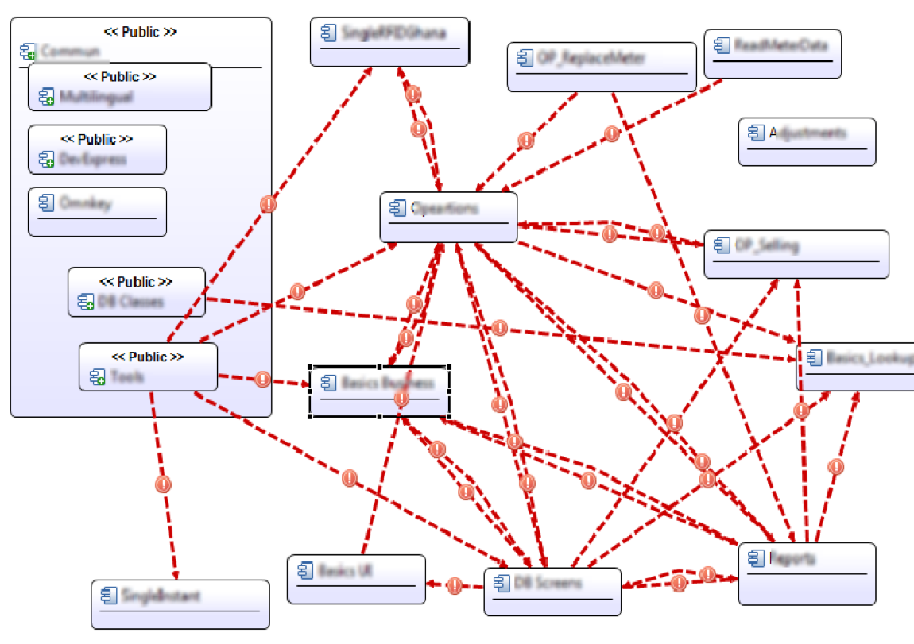

As you can see, both systems suffer from so many violations and circular dependencies. You may also anticipate many un-necessary calls and high level coupling among components.

To fix this situation, we gradually worked on moving classes and methods around to reduce dependencies and remove violations. Using two simple refactorings: *Move Class* and *Move Method*, we managed to remove most of the violations.

The key takeaway of this experiment is that existing architectural components should be honored and refined during first attempts to reduce dependencies and lower coupling between components.

[^conqat]: Architectural analysis is done by [ConQAT](https://www.cqse.eu/en/products/conqat/overview/), a **Con**tinuous **Q**u**a**li**t**y monitoring tool developed by the Technical University of Munich.
